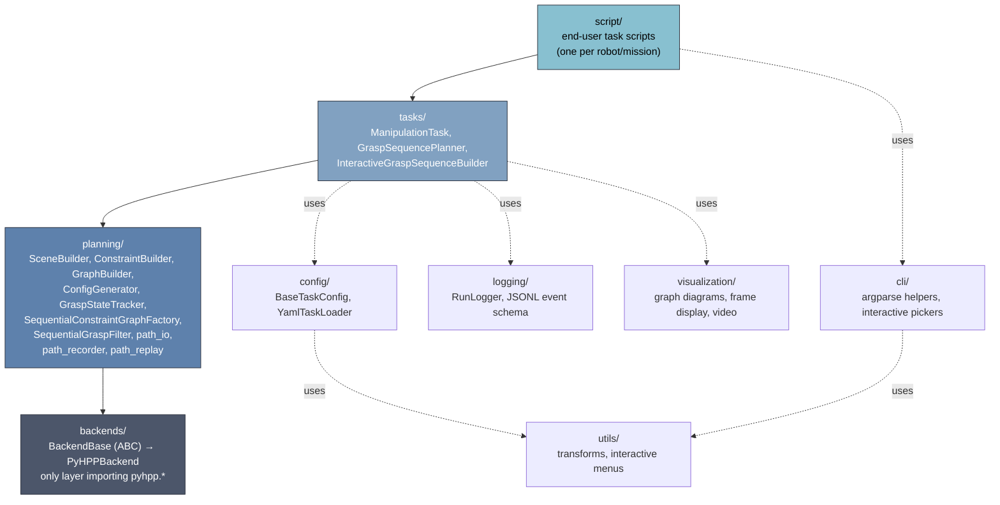
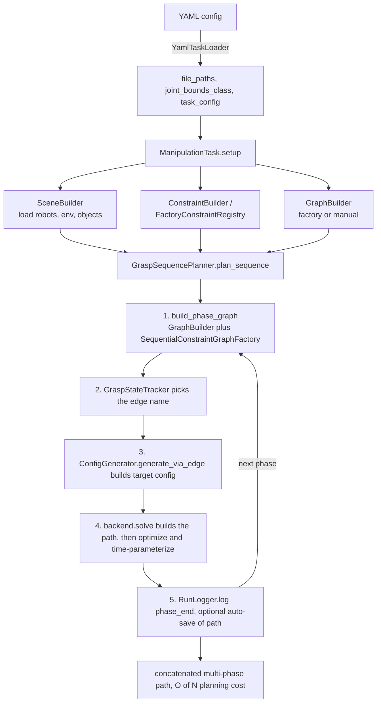

# long_tamp — Architecture

**Last reviewed against source:** 2026-08-18, commit `bc4898d`. This doc lags actual
code by design (it documents layer boundaries, not every module) — if a newer module or
feature isn't listed below, check `git log --since=<this date> -- src/long_tamp`
before assuming it's missing rather than just undocumented.

`long_tamp` is a **standalone Python library** for multi-arm, multi-object
manipulation planning on top of HPP (Humanoid Path Planner). This document
describes the architecture of the package *by itself* — its module layering,
core abstractions, and data flow — independent of any ROS 2 workspace,
launch stack, or robot-specific integration it may be consumed from. Nothing
in `src/long_tamp/` imports `rclpy` or any ROS 2 package; ROS 2 is,
at most, a downstream consumer (e.g. building this package with `colcon`
alongside other packages) and a way to obtain URDF/SRDF files, not a
dependency of the planning logic.

The package can be installed and used with plain `pip install -e .` and
run as ordinary Python scripts (`python script/.../task_my_task.py`) — see
[README.md](README.md) for installation. This document is about *how the
code is put together*, not how to deploy it.

## Design goals

- **Backend independence.** Task/planning code is written once against an
  abstract interface and runs unmodified on either of two HPP bindings.
- **Linear-cost multi-grasp planning.** Long assembly sequences (many
  grasp/place/hand-over phases) must plan in **O(N)**, not the **O(N!)**
  blow-up of a single monolithic constraint graph over all grasp
  combinations.
- **Composable building blocks over inheritance-heavy frameworks.** Scene
  setup, constraint creation, graph construction, and configuration
  generation are separate, independently testable objects that a task
  composes rather than a single god-object.
- **Config-as-data.** A task's robots, objects, grasp pairs, and joint
  bounds are declarative (YAML or a small dataclass config), not
  hard-coded across the planning code.
- **Reproducibility.** Every planning run can be logged, replayed, and
  audited without re-running the (possibly slow, non-deterministic)
  planner.

## Layered module structure

```
┌────────────────────────────────────────────────────────────────┐
│  script/  — end-user task scripts (one per robot/mission)       │
│  Compose the layers below; the only place robot-specific        │
│  wiring lives.                                                  │
└───────────────────────────┬──────────────────────────────────────┘
                            │ uses
┌───────────────────────────▼──────────────────────────────────────┐
│  tasks/            ManipulationTask, GraspSequencePlanner,        │
│                     InteractiveGraspSequenceBuilder                │
│  Orchestrates one task's lifecycle: setup → plan → (replay).      │
└───────────────────────────┬──────────────────────────────────────┘
                            │ uses
┌───────────────────────────▼──────────────────────────────────────┐
│  planning/          SceneBuilder, ConstraintBuilder, GraphBuilder, │
│                     ConfigGenerator, GraspStateTracker,            │
│                     SequentialConstraintGraphFactory,              │
│                     SequentialGraspFilter, path_io                 │
│                     path_recorder, path_replay                     │
│  Backend-agnostic planning primitives, each independently usable.  │
└───────────────────────────┬──────────────────────────────────────┘
                            │ uses
┌───────────────────────────▼──────────────────────────────────────┐
│  backends/          BackendBase (ABC) → PyHPPBackend               │
│  The only layer that imports HPP-specific bindings (pyhpp.*).      │
│  Everything above this line is backend-blind.                      │
└────────────────────────────────────────────────────────────────┘

  config/  — declarative task configuration (BaseTaskConfig, YamlTaskLoader)
             consumed by tasks/ and planning/
  logging/ — RunLogger + JSONL event schema, cross-cutting, used by tasks/
  visualization/ — constraint-graph diagrams, handle/gripper frame display,
             video recording; cross-cutting, used by tasks/ and scripts
  utils/   — transforms (SE3 ⇄ xyzrpy ⇄ xyzquat), interactive terminal menus
  cli/     — argparse helpers and interactive pickers shared by task scripts
```



Dependency direction is strictly downward: `tasks` depends on `planning`
and `backends`; `planning` depends on `backends`; `backends` depends on
nothing else in the package. `config`, `logging`, `visualization`, `utils`
are horizontal support layers with no dependency on `tasks`/`planning`
internals (aside from `planning/config.py` optionally importing a task's
own config module lazily, guarded by `try/except ImportError`, to avoid a
hard coupling).

## Backends (`backends/`)

`backends/base.py` defines `BackendBase`, an ABC covering everything a
planning primitive needs from an HPP binding: robot/environment/object
loading, configuration-space queries, constraint-graph state/edge
creation, path planning and validation, path I/O, and visualization.
`ConstraintResult` is the uniform return type for constraint-projection
calls (`success`, `configuration`, `error`).

One concrete implementation satisfies that interface:

- **`PyHPPBackend`** (`pyhpp.py`, the only backend) — in-process bindings
  via `hpp-python`. No RPC/server process; direct calls into the HPP C++
  core through pybind11 bindings. Requires a source-built/customized HPP
  for several symbols this project relies on (see README for the exact
  list); a plain robotpkg install of `hpp-python` imports but reports
  itself unavailable.

  A CORBA backend (`hppcorbaserver` over `hpp-manipulation-corba`)
  previously existed here and has been removed — see
  `docs/legacy/hpp_python_interface/` for historical reference.

The import is wrapped in `try/except ImportError` in
`backends/__init__.py`, which exposes a `HAS_PYHPP` flag and
`get_available_backends()` / `get_backend(name)`. A backend that fails to
import is not a hard error at package-import time — it only raises when
something actually tries to construct it, with a message naming the
missing native package. This is what lets the pure-Python parts of the
package (config parsing, transforms, run logging, graph visualization)
import and work even with zero HPP bindings installed.

`planning/planner.py`'s `create_planner(backend=...)` is the factory that
turns a backend name into a ready planner instance; this is the one
function most task scripts call to bootstrap everything else.

## Planning primitives (`planning/`)

Each class here does one job and is usable on its own, independent of the
`tasks/` orchestration layer:

- **`SceneBuilder`** — fluent API (`load_robot().load_environment()
  .load_objects([...]).set_joint_bounds().build()`) that loads robots,
  static environment, and movable objects into a backend instance and
  wires up collision-pair exclusions.
- **`ConstraintBuilder`** — creates grasp, placement, complement, and
  locked-joint constraints against the backend through a uniform
  signature (`backend="pyhpp"`). `FactoryConstraintRegistry` is the
  companion piece for the
  constraint-graph-*factory* path: it names and registers the
  grasp/pregrasp/placement/complement/hold constraints the factory
  expects (`{gripper} > {handle}`-style naming) so the constraint graph
  factory can look them up by convention instead of by hand-wiring.
- **`GraphBuilder`** — builds the HPP constraint graph two ways:
  - **factory mode** — hands grippers/objects/handles to a
    `ConstraintGraphFactory` (or the sequential variant below) which
    auto-generates states and edges from declared grasp rules;
  - **manual mode** — explicit `add_state()` / `add_edge()` /
    `add_state_constraints()` calls for graphs that don't fit the
    factory's combinatorial model.

  `build_phase_graph()` is the entry point `GraspSequencePlanner` uses to
  rebuild a *minimal* graph for just the next phase (see below).
- **`SequentialConstraintGraphFactory`** (`sequential_graph_factory.py`)
  — a `ConstraintGraphFactory` subclass that overrides
  `transitionIsAllowed()` to only build states/edges reachable along one
  specific grasp sequence, instead of the full cross product of grasp
  combinations. This is the mechanism that turns graph construction from
  **O(N!)** states/edges into **O(N)**.
- **`SequentialGraspFilter` / `SequentialTransitionFilter`**
  (`sequential_grasp_filter.py`) — the filtering predicates the factory
  above consults; encode "which grasp tuples are on the planned path" as
  abbreviated state strings (`"0-1:2-3"`, `"f"` for free) and answer
  transition-legality queries in O(1).
- **`GraspStateTracker`** (`grasp_state.py`) — tracks which gripper holds
  which handle at each point in a sequence and derives the constraint
  graph's edge names for grasp/release/loop transitions from that state,
  matching the factory's naming convention. This is the glue that lets
  `GraspSequencePlanner` ask "what edge do I take to grasp X now?"
  without re-deriving graph topology by hand each phase.
- **`ConfigGenerator`** — projects configurations onto graph nodes
  (`project_on_node`), generates configurations by walking a graph edge
  (`generate_via_edge`), and does BFS edge-path search between states
  (`bfs_edge_path`) when a direct edge isn't known.
- **`path_io.py`** — save/load/replay planned paths to/from files, so a
  solved path can be replayed without re-solving.
- **`PathRecorder`** (`path_recorder.py`) / **`path_replay.py`** — a
  newer, more durable capture mechanism than `path_io.py`: samples every
  planned/executed path to disk as it happens (`manifest.json`,
  atomically rewritten after each segment, plus one waypoint file per
  segment), so a run's motion can be continuity-checked or replayed in a
  *separate process* — after the original crashed, was killed, or simply
  exited — without rebuilding any constraint graph.
  `path_replay.py`'s `load_manifest()`/`validate()` re-derive segment
  continuity independently of the recorder that wrote them; there is no
  shipped CLI entry point for this yet, only the library functions.

## Task orchestration (`tasks/`)

- **`ManipulationTask`** (ABC, `tasks/base.py`) — the lifecycle contract
  every concrete task implements: `get_objects()`, `create_constraints()`,
  `create_graph()`, `build_initial_config()`, `generate_configurations()`,
  then `setup()` (wires scene + constraints + graph together) and
  `run()` (generates configs and optionally solves/visualizes). Owns an
  optional `RunLogger` (`log_dir`, on by default).
- **`GraspSequencePlanner`** (`tasks/grasp_sequence.py`, the largest
  module in the package) — plans an arbitrary-length chain of grasp /
  release / hand-over phases as one continuous, concatenated path.
  Per phase it: builds a phase-local minimal graph via `GraphBuilder`
  + `SequentialConstraintGraphFactory`, computes which joints to freeze
  for arms not involved in this phase
  (`compute_phase_locked_joints`), asks `GraspStateTracker` for the
  edge to take, solves, optionally auto-saves the resulting path, and
  advances to the next phase. Supports pausing (`get_resumable_state`)
  and resuming (`resume_sequence`) a partially-completed sequence,
  graceful interrupt handling (`enable_graceful_stop`/SIGINT), and full
  replay (`replay_sequence`) from previously saved paths.
  `find_feasible_phase_target()` adds an optional one-phase lookahead:
  before committing phase N's randomized grasp target, it probes — on a
  throwaway copy of `GraspStateTracker`, never mutating the real one —
  whether phase N+1 stays reachable from it, so a target that would
  orient-lock an object out of its next grasp is rejected before
  commitment rather than retried forever afterward. A passing candidate
  is replayed into the real `plan_sequence()`/`resume_sequence()` call as
  a per-edge warm-start hint chain (`phase_q_hints`). See
  `docs/features/phase-target-lookahead.md`.
- **`InteractiveGraspSequenceBuilder`** — terminal menu-driven wrapper
  around `GraspSequencePlanner` for exploratory/interactive planning
  sessions (used by `script/*/interactive_planning.py`).

## Configuration (`config/`)

Two ways to describe a task's robots/objects/grasps, both producing the
same runtime shape consumed by `SceneBuilder`/`ManipulationTask`:

- **`BaseTaskConfig`** (`base_config.py`) — an ABC plus small dataclasses
  (`ModelPaths`, `TransformConfig`, `ConstraintDef`, `StateDef`,
  `EdgeDef`, `Defaults`) for hand-written Python task configs. Concrete
  subclasses declare file paths, initial poses, and grasp/state/edge
  definitions as class-level data.
- **`YamlTaskLoader`** (`yaml_loader.py`, recommended for new tasks) —
  reads a single YAML file and produces `file_paths`, a
  `joint_bounds_class`, a `task_config` compatible with
  `BaseTaskConfig`, and `build_initial_config()`. This is what makes a
  task script robot-agnostic: no Python file in the framework needs to
  know a specific robot's joint or file names, only the YAML does. See
  `script/templates/` for the copy-paste starting point and
  `script/twin/config/twin_lift_ball_config.yaml` for a real-world
  example.

## Cross-cutting layers

- **`logging/`** — `RunLogger` writes a crash-safe JSONL event stream
  (`run_start`, `config_snapshot`, `sequence_start`, `phase_start`,
  `edge_start`, `edge_end`, `phase_end`, `run_end`; shapes fixed in
  `schema.py`) plus a JSON snapshot and a replay-ready YAML on close.
  `log_loader.py` reads runs back (`load_run_log`, `iter_events`,
  `get_replay_config`, `print_run_summary`) so a run can be inspected or
  reproduced without re-invoking the planner. `setup.py` wires the
  standard `logging` module hierarchy (`configure_logging`,
  `get_logger`) independent of `RunLogger`.
- **`visualization/`** — `viz.py` draws constraint-graph diagrams
  (static PNG and a live interactive window) and displays
  handle/gripper coordinate frames (with approach direction) in
  whichever viewer the backend is using (viser by default, or Gepetto
  via CORBA). `video_recorder.py` records path playback to video.
  Nothing here talks to a backend directly — it's driven off the
  `robot`/`viewer` objects a backend produces.
- **`utils/`** — `transforms.py` (SE3 ⇄ xyzquat ⇄ xyzrpy conversions,
  `BoundsManager`, `ConfigBuilder`) and `interactive.py` (raw-terminal
  menu helpers used by the interactive builder and CLI pickers). Pure
  functions/classes with no HPP or backend dependency.
- **`cli/`** — `argparse` fragment builders (`add_common_arguments`,
  `add_task_arguments`, `add_grasp_sequence_arguments`, …) and
  `interactive_pickers.py` (terminal pickers for grasp pairs, frozen
  arms, saved-path browsing) shared across `script/*/task_*.py` entry
  points, so each task script doesn't reimplement its own CLI.

## Data flow for a typical run

```
YAML config ──► YamlTaskLoader ──► file_paths, joint_bounds_class, task_config
                                          │
                                          ▼
                              ManipulationTask.setup()
                                          │
              ┌───────────────────────────┼────────────────────────────┐
              ▼                           ▼                            ▼
        SceneBuilder                ConstraintBuilder /          GraphBuilder
   (load robots/env/objects)      FactoryConstraintRegistry   (factory or manual)
              │                           │                            │
              └───────────────┬───────────┴────────────────────────────┘
                              ▼
                    GraspSequencePlanner.plan_sequence(q_init, sequence)
                              │  per phase:
                              │   1. build_phase_graph()  (GraphBuilder + SequentialConstraintGraphFactory)
                              │   2. GraspStateTracker → edge name for this transition
                              │   3. ConfigGenerator.generate_via_edge() → target config
                              │   4. backend.solve() → path; optimize/time-parameterize
                              │   5. RunLogger.log(phase_end, ...); optional auto-save path
                              ▼
                  concatenated multi-phase path (O(N) planning cost)
```



## Extension points

- **New backend**: implement `BackendBase`, add it to
  `backends/__init__.py`'s `try/except` block and `get_backend()`. All of
  `planning/`, `tasks/`, `config/` work unmodified against it as long as
  the ABC contract is met.
- **New robot/task**: write a YAML config (`script/templates/
  task_config_template.yaml`) and a task script
  (`script/templates/task_my_task.py`) — no changes to the framework
  package itself. Adding objects/tools/grasp pairs is a config change
  (`VALID_PAIRS`), not a code change.
- **New optimizer / time-parameterization**: `backends/pyhpp.py` detects
  optional bindings (`HAS_TOPPRA`, `HAS_TRAPEZOIDAL`, …) at import time
  via guarded imports, following the same pattern as backend
  availability — add a guarded import + a capability flag rather than a
  hard dependency.

## What this document intentionally excludes

This package has no ROS 2 nodes, topics, services, actions, or launch
files of its own — it is a planning *library*. How a mission/behavior
tree layer, a ROS 2 executor, or a Gazebo simulation invokes this
package (e.g. the wider `ros2_ws_agimusxads` workspace) is integration
detail that lives outside `long_tamp` and outside the scope of
this document. The `CMakeLists.txt` / `package.xml` in this repo only
exist so the package can optionally be installed via `colcon`/`ament`
alongside an HPP source build (`WITH_PYHPP` / `WITH_TOPPRA` options
select which native bindings to link against at install time) — they do
not add a ROS 2 runtime dependency to the Python code itself.
