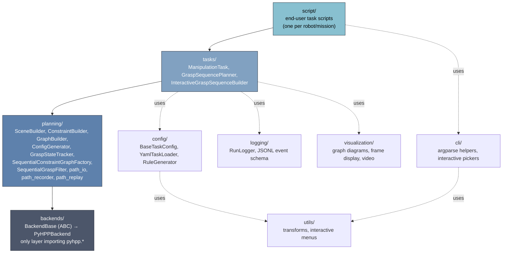
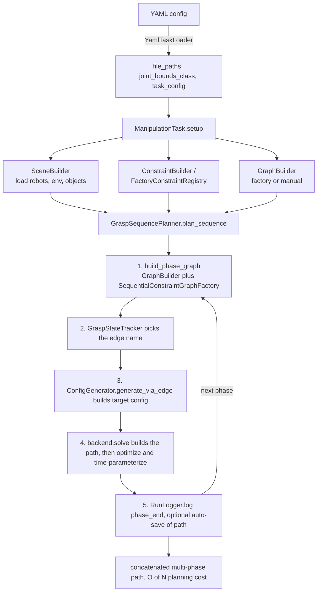

# Long-TAMP - Long-Horizon Task-and-Motion Planning

Long-horizon, multi-arm task-and-motion planning (TAMP) for manipulation, built on HPP (Humanoid Path Planner).

`long_tamp` plans **long, multi-step manipulation sequences** for **several robot arms working together** on **many movable objects** in a single shared scene. It builds on HPP's constraint-graph manipulation planning and adds a task/orchestration layer that turns a high-level goal (grip this, move that, hand it over, place it) into a single concatenated, collision-free motion for the whole multi-robot system. See `script/twin/` for a runnable bimanual example.

## Capabilities

- **Long-horizon sequence planning.** The `GraspSequencePlanner` chains an arbitrary number of grasp/place/hand-over phases into one continuous plan. Each phase gets a *minimal, phase-local* constraint graph and the paths are concatenated across phases, so planning cost grows **linearly O(N)** with the number of grasps instead of combinatorially **O(N!)** — long assembly missions stay tractable.
- **Multiple robots (multi-arm & collaborative).** The scene composes several arms into one planning model (a composite `Device` spanning all of them) that plan in a shared, mutually-collision-aware world. Arms can act independently, cooperate on the same object, or hand objects off between each other.
- **Multiple objects.** Any number of free-flying objects and tools coexist in the scene. Grasp legality is data-driven via `VALID_PAIRS` (which gripper may grasp which handle), so adding objects/tools is a config change, not a code change.
- **Constraint-graph manipulation planning.** Grasp, placement, and transition constraints are generated from a declarative `ManipulationConfig`; the constraint graph and its edges are built automatically per phase.
- **Reproducibility, introspection & crash recovery.** Structured, crash-safe JSONL run logging captures every phase/edge attempt for replay, debugging, and auditing (see *Run Logging*); a separate path-capture mechanism (`PathRecorder`) samples every planned/executed path to disk as it happens, so a run can be continuity-checked or replayed in a fresh process after a crash, and long missions can checkpoint and resume rather than replan from the start (see [`docs/usage/standalone-usage.md`](docs/usage/standalone-usage.md) §§8–10).
- **Modular architecture.** Reusable building blocks — `SceneBuilder`, `ConstraintBuilder`, `ConfigGenerator`, `ManipulationTask`, `create_planner()` — compose into custom tasks.
- **Scene visualization.** Interactive 3D viewers: browser-based **viser** (default, no X11) or **gepetto-viewer** (Qt).
- **PyHPP backend**: in-process bindings via `hpp-python`.

## Installation

`long_tamp` has two distinct dependency tiers, and this drives how you install it:

| Tier | Packages | Source |
|------|----------|--------|
| **Python (PyPI)** | `numpy`, `pyyaml`, `pinocchio` (`pin`), and the viser viewer stack (`viser`, `trimesh`, `pycollada`) | `pip` |
| **HPP native bindings** | `hpp-python` (pyhpp), `hpp-toppra`, `hpp-gepetto-viewer`, … | **robotpkg / conda-forge / source only — NOT on PyPI** |

The HPP native bindings are C++ extension modules and **cannot be installed with pip**. `pip install long-tamp` therefore gives you a working *pure-Python* package (config parsing, planning-graph construction, transforms, run logging, viser viewer), but the planning **backends** must be provided by your environment (the `hpp-agimus` container, robotpkg, or conda-forge). Instantiating a backend without its bindings raises an `ImportError` explaining exactly what is missing.

Install in **two steps, in this order**: first the HPP native bindings that provide the planning backends, then the `long_tamp` package itself. Installing the package first is pointless — it cannot plan until the backends are on the path.

---

### Step 1 — Install the HPP native bindings (do this first)

These C++ extension modules provide the planning backends and **cannot be installed with pip**. Put them in place before installing or running `long_tamp`. There are two ways to obtain them: the robotpkg binary (1a) or a source build / container (1b). **The default PyHPP backend currently requires the source build (1b)**, because the stable robotpkg binary does not yet ship the extra bindings — see the caveat below.

#### 1a. Binary install via robotpkg

Follow the **[official HPP installation guide](https://humanoid-path-planner.github.io/hpp-doc/installation/installation.html)** to add the robotpkg APT repository and set up your environment (`PATH`, `LD_LIBRARY_PATH`, `PYTHONPATH`, `CMAKE_PREFIX_PATH` under `/opt/openrobots`) — that page is the authoritative source for repository setup and exact package availability per Ubuntu release, so it isn't duplicated here.

> **⚠️ Prefer the source-built/devel environment over the stable robotpkg
> release for the PyHPP backend.** `long_tamp` relies on a handful of
> `pyhpp` bindings — `RSTimeParameterization`, `SimpleTimeParameterization`,
> `EnforceTransitionSemantic`, `GraphRandomShortcut` / `GraphPartialShortcut`,
> `SplineGradientBased_bezier{1,3,5}`, and `ProgressiveProjector` — that the
> current stable release (`hpp-python` 6.1.0) does not yet ship. The
> source-built HPP (the `hpp-agimus` container / `DEVEL_HPP_DIR` flow — see
> *Source build* below) always has them; the robotpkg binary is still fine
> for the C++ toolchain regardless.
>
> **If you do use the robotpkg binary, check it actually provides those
> symbols before relying on it** — `import pyhpp` succeeding doesn't confirm
> that:
> ```bash
> python -c "from long_tamp import get_available_backends; print(get_available_backends())"
> ```
> If `pyhpp` is missing from the result, or constructing it raises **"PyHPP
> backend unavailable,"** one of the symbols above is absent from your
> binary — switch to the source build. Track
> [humanoid-path-planner/hpp-python](https://github.com/humanoid-path-planner/hpp-python)
> for when a stable release picks these up.

Once the repository is configured, install just the two packages this project needs (package names are `robotpkg-py<pyver>-<name>`, where `<pyver>` matches your Python — Ubuntu 24.04 → `312`, 22.04 → `310`, 20.04 → `38`):

```bash
pyver=312   # adjust to your Python version

sudo apt-get install \
  robotpkg-py${pyver}-hpp-python \
  robotpkg-py${pyver}-qt5-hpp-gepetto-viewer
```

| Package | Provides | Pulls in (transitively) |
|---------|----------|-------------------------|
| `robotpkg-py${pyver}-hpp-python` | PyHPP backend (`pyhpp.*`) | pinocchio, eigenpy, coal, hpp-util, hpp-pinocchio, hpp-core, hpp-constraints, hpp-manipulation, hpp-manipulation-urdf, hpp-corbaserver, omniorbpy |
| `robotpkg-py${pyver}-qt5-hpp-gepetto-viewer` | Gepetto + `pyhpp_viser` viewers | gepetto-viewer-corba, qgv, qtbase5 |

Both are required, not just `hpp-python` — despite the name, the second package is where
**all** viewer bindings live, including `pyhpp_viser` (the browser-based viser viewer this
project defaults to), not just the legacy Qt/CORBA Gepetto viewer. `hpp-python` alone plans
headlessly with no viewer at all; without the second package, `task_lift_ball.py
--viewer-type viser` from Quick Start has nothing to display into.

**Not available as a binary — TOPPRA.** `hpp-toppra` and its `toppra` C++
dependency are not published in robotpkg (checked: absent from both `pub`
and `wip`, all distros). To use the TOPPRA optimizer, build `toppra` and
`hpp-toppra` from source — this is what the `hpp-agimus` container does.

#### 1b. Source build / container — required for the PyHPP backend today

The recommended way to get a complete, matching HPP stack is the prebuilt Docker image, which compiles HPP from source under `$DEVEL_HPP_DIR` (`~/devel/hpp`). All backends — including the customized `pyhpp` bindings this project relies on — are available inside it without any robotpkg install.

The Docker definitions live in a separate repository: [gitlab.laas.fr/dvtnguyen/dockers](https://gitlab.laas.fr/dvtnguyen/dockers). It provides **two images, one per ROS 2 distribution**:

| Directory | ROS 2 distro | Ubuntu base |
|-----------|--------------|-------------|
| `hpp/` | Jazzy | 24.04 (noble) |
| `hpp-humble/` | Humble | 22.04 (jammy) |

Pick the one matching your target ROS 2 version, build it (`run_docker.sh` in each directory), and work inside the container. To reproduce the build outside Docker, follow the same steps on the host and point `PYTHONPATH` / `LD_LIBRARY_PATH` at your source-install prefix instead of `/opt/openrobots`.

---

### Step 2 — Install the `long_tamp` package

With the HPP native bindings from Step 1 in place, install the package itself — either with pip (standalone / development) or with CMake (inside an HPP workspace).

#### 2a. pip (standalone / development)

```bash
# Editable install with the default viser viewer stack
pip install -e .

# With dev tooling (pytest, black, ruff, sphinx)
pip install -e ".[dev]"

# Standalone WITHOUT an HPP stack — also pulls pinocchio from PyPI:
pip install -e ".[standalone]"
```

This resolves the Python tier only; the planning backends come from Step 1.

> **⚠️ NumPy ABI — do not install `pinocchio` from PyPI on top of robotpkg.**
> The robotpkg/`/opt/openrobots` pinocchio is compiled against **NumPy 1.x**. A
> NumPy 2.x in your user/site path shadows the system numpy and **segfaults**
> the pinocchio C-extension (`_multiarray_umath` ImportError → core dump).
> Therefore:
> - `pinocchio` is **not** a default pip dependency (use `[standalone]` only
>   when no HPP stack is present), and the default numpy is pinned `<2`.
> - In a robotpkg environment, if a stray NumPy 2.x got installed, remove it:
>   `pip uninstall -y numpy pin` (Python then falls back to the system
>   NumPy 1.26 that pinocchio expects). Verify with
>   `python -c "import numpy; print(numpy.__version__, numpy.__file__)"`.
> - Cleanest of all in a robotpkg env: `pip install --no-deps -e .` and let the
>   system/robotpkg provide numpy + pinocchio.

#### 2b. CMake (in an HPP workspace)

This is the source of truth for the native backends. It installs the Python package into `PYTHON_SITELIB` alongside the HPP libraries.

```bash
mkdir build && cd build
cmake .. -DCMAKE_INSTALL_PREFIX=$INSTALL_HPP_DIR
make install
```

Build options (see `CMakeLists.txt`):

| Option | Default | Provides | Native prerequisites |
|--------|:-------:|----------|----------------------|
| `WITH_PYHPP`  | **ON**  | PyHPP backend (default) | `hpp-python` |
| `WITH_TOPPRA` | OFF     | TOPPRA time-parameterization optimizer | `hpp-toppra` (which requires the `toppra` C++ lib ≥0.6.2) |

`hpp-gepetto-viewer` is picked up whenever `WITH_PYHPP` is enabled — it provides both the Gepetto (Qt) viewer and the `pyhpp_viser` browser viewer.

```bash
# Enable the optional TOPPRA optimizer:
cmake .. -DCMAKE_INSTALL_PREFIX=$INSTALL_HPP_DIR -DWITH_TOPPRA=ON
```

### Optional feature extras

The pip extras below carry **no PyPI packages** — they are documented install targets. The listed native packages must come from robotpkg / conda-forge.

| Extra | Command | Native packages to install separately |
|-------|---------|---------------------------------------|
| `toppra` | `pip install "long-tamp[toppra]"` | `hpp-toppra`, `toppra` — **source build only** (not in robotpkg) |

### Backend availability at runtime

The viser browser viewer ships by default. The other optimizers/viewers are detected at import time and expose `HAS_*` flags in `long_tamp.backends.pyhpp` (`HAS_PYHPP`, `HAS_TOPPRA`, `HAS_VISER`, `HAS_GEPETTO_VIEWER`). A missing backend fails loudly only when you try to construct it, with guidance on how to obtain the bindings.

## Usage

Writing a task means implementing `ManipulationTask`'s lifecycle contract (`get_objects()`,
`create_constraints()`, `create_graph()`, `build_initial_config()`,
`generate_configurations()`, then `setup()` / `run()`) — either by hand, or, for new tasks,
via a declarative YAML config (recommended). Full, runnable examples live in
[`docs/usage/standalone-usage.md`](docs/usage/standalone-usage.md) §§4–6 rather than
duplicated here, alongside multi-phase sequences, resume/replay/checkpoints, and backend
selection.

- **Start from a template**: `script/templates/task_config_template.yaml` +
  `task_my_task.py` — copy, fill in the `<PLACEHOLDER>`s, run.
- **Read a real, minimal example**: `script/twin/task_lift_ball.py` (bimanual scene).

## Package structure & architecture

`tasks/` orchestrates `planning/`, which is backend-agnostic and depends only on `backends/`
(the one place HPP-specific bindings are imported); `config/`, `logging/`, `visualization/`,
`utils/`, and `cli/` are horizontal support layers used from `tasks/` and `script/`.



Per-phase planning data flow, the loop every mission ultimately runs through:



Both diagrams are copied from **[`ARCHITECTURE.md`](ARCHITECTURE.md)**, which is the
maintained source — it's dated at the top and covers dependency direction and what each
class does in more depth than fits here. If the two ever disagree, trust `ARCHITECTURE.md`
and update this copy to match.

## Run Logging

`long_tamp` includes a structured run logger that writes a crash-safe JSONL event
stream for every planning run — one event per phase/edge attempt, plus a JSON snapshot and a
replay-ready YAML on close. Use it to replay configurations, debug failures, and audit
results.

Logging is **on by default** for every `ManipulationTask` (`log_dir="auto"` creates
`/tmp/long_tamp/<task_slug>_<timestamp>/`; pass an explicit path to redirect it, or
`None` to disable). `RunLogger` also works standalone, independent of `ManipulationTask`.

| Event | When emitted |
|-------|-------------|
| `run_start` | `ManipulationTask.__init__` (with `log_dir`) |
| `config_snapshot` | `setup()` — full `BaseTaskConfig` + setup params |
| `sequence_start` | Start of `plan_sequence()` — all call params + `q_init` |
| `phase_start` | Before each grasp phase — `gripper`, `handle`, `q_start` |
| `edge_start` | Before each transition edge attempt |
| `edge_end` | After each edge — `success`, timing, `q_to` or `error` |
| `phase_end` | After each phase — timing, `state_after`, saved files |
| `run_end` | On normal return or `KeyboardInterrupt` |

For runnable examples — standalone use, inspecting a log afterward
(`print_run_summary`/`load_run_log`/`get_replay_config`), and configuring the underlying
Python `logging` hierarchy — see [`docs/usage/standalone-usage.md`](docs/usage/standalone-usage.md) §10.

## Documentation

- **Architecture**: [`ARCHITECTURE.md`](ARCHITECTURE.md) — module layering, dependency direction, data flow. Dated at the top; check it before trusting a claim about what exists.
- **Usage guide (living reference)**: [`docs/usage/standalone-usage.md`](docs/usage/standalone-usage.md) — writing a task, multi-phase sequences, resume/replay/checkpoints, backends, example scripts.
- **Development report**: [`docs/legacy/report/development-report.md`](docs/legacy/report/development-report.md) — *why* the framework is built this way: architecture decisions vs. bare HPP, measured before/after numbers, project timeline, and a bugs-found appendix. A point-in-time report, not a living reference.
- **Design rationale for specific mechanisms**: [`docs/features/`](docs/features/); **upstream HPP defects worked around here**: [`docs/bugs/`](docs/bugs/).
- **API Reference**: See docstrings in source files.
- **ROS-free BehaviorTree.CPP integration**: [`docs/usage/behaviortree-integration.md`](docs/usage/behaviortree-integration.md).

## License

LGPL-3.0 - See [LICENSE](LICENSE) file


---

**Last Updated**: 2026-08-18
