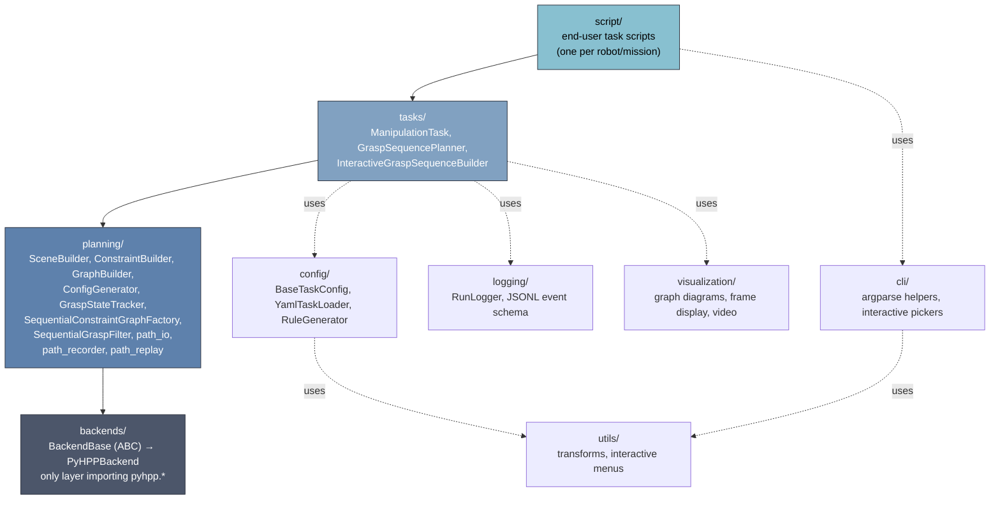
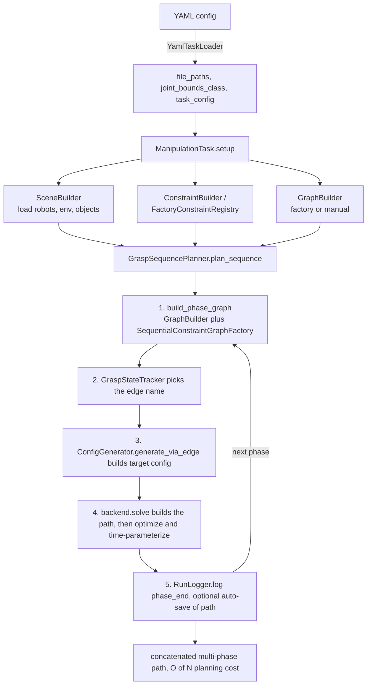

# Long-TAMP - Long-Horizon Task-and-Motion Planning

Long-horizon, multi-arm task-and-motion planning (TAMP) for manipulation, built on HPP (Humanoid Path Planner).

`long_tamp` plans **long, multi-step manipulation sequences** for **several robot arms working together** on **many movable objects** in a single shared scene. It builds on HPP's constraint-graph manipulation planning and adds a task/orchestration layer that turns a high-level goal (grip this, move that, hand it over, place it) into a single concatenated, collision-free motion for the whole multi-robot system. See `script/twin/` for a runnable bimanual example.

## Capabilities

- **Long-horizon sequence planning.** The `GraspSequencePlanner` chains an arbitrary number of grasp/place/hand-over phases into one continuous plan. Each phase gets a *minimal, phase-local* constraint graph and the paths are concatenated across phases, so planning cost grows **linearly O(N)** with the number of grasps instead of combinatorially **O(N!)** — long assembly missions stay tractable.
- **Multiple robots (multi-arm & collaborative).** The scene composes several arms into one planning model (a composite `Device` spanning all of them) that plan in a shared, mutually-collision-aware world. Arms can act independently, cooperate on the same object, or hand objects off between each other.
- **Multiple objects.** Any number of free-flying objects and tools coexist in the scene. Grasp legality is data-driven via `VALID_PAIRS` (which gripper may grasp which handle), so adding objects/tools is a config change, not a code change.
- **Constraint-graph manipulation planning.** Grasp, placement, and transition constraints are generated from a declarative `ManipulationConfig`; the constraint graph and its edges are built automatically per phase.
- **Reproducibility, introspection & crash recovery.** Structured, crash-safe JSONL run logging captures every phase/edge attempt for replay, debugging, and auditing (see *Run Logging*); a separate path-capture mechanism (`PathRecorder`) samples every planned/executed path to disk as it happens, so a run can be continuity-checked or replayed in a fresh process after a crash, and long missions can checkpoint and resume rather than replan from the start (see [`docs/usage/standalone-usage.md`](docs/usage/standalone-usage.md) §§8–10).
- **Modular architecture.** Reusable building blocks — `SceneBuilder`, `ConstraintBuilder`, `ConfigGenerator`, `ManipulationTask`, `create_planner()` — compose into custom tasks.
- **Scene visualization.** Interactive 3D viewers: browser-based **viser** (default, no X11) or **gepetto-viewer** (Qt).
- **PyHPP backend**: in-process bindings via `hpp-python`.

## Installation

`long_tamp` has two dependency tiers: a pure-Python tier installable from PyPI, and the HPP
native bindings (`hpp-python`, `hpp-toppra`, `hpp-gepetto-viewer`), which are C++ extension
modules **not on PyPI** and must come from robotpkg, conda-forge, or a source build/container.
Install the native bindings first, then the package:

```bash
# Step 1: HPP native bindings — robotpkg or the hpp-agimus source-built container
# (the default PyHPP backend needs the source build today; see docs/INSTALL.md)

# Step 2: the long_tamp package
pip install -e .
```

Full instructions — robotpkg vs. source build, the CMake install path, optional extras
(`toppra`), the NumPy/pinocchio ABI pitfall, and runtime backend detection — are in
[`docs/INSTALL.md`](docs/INSTALL.md).

## Usage

Writing a task means implementing `ManipulationTask`'s lifecycle contract (`get_objects()`,
`create_constraints()`, `create_graph()`, `build_initial_config()`,
`generate_configurations()`, then `setup()` / `run()`) — either by hand, or, for new tasks,
via a declarative YAML config (recommended). Full, runnable examples live in
[`docs/usage/standalone-usage.md`](docs/usage/standalone-usage.md) §§4–6 rather than
duplicated here, alongside multi-phase sequences, resume/replay/checkpoints, and backend
selection.

- **Start from a template**: `script/templates/task_config_template.yaml` +
  `task_my_task.py` — copy, fill in the `<PLACEHOLDER>`s, run.
- **Read a real, minimal example**: `script/twin/task_lift_ball.py` (bimanual scene).

## Package structure & architecture

`tasks/` orchestrates `planning/`, which is backend-agnostic and depends only on `backends/`
(the one place HPP-specific bindings are imported); `config/`, `logging/`, `visualization/`,
`utils/`, and `cli/` are horizontal support layers used from `tasks/` and `script/`.



Per-phase planning data flow, the loop every mission ultimately runs through:



Both diagrams are copied from **[`ARCHITECTURE.md`](ARCHITECTURE.md)**, which is the
maintained source — it's dated at the top and covers dependency direction and what each
class does in more depth than fits here. If the two ever disagree, trust `ARCHITECTURE.md`
and update this copy to match.

## Run Logging

`long_tamp` includes a structured run logger that writes a crash-safe JSONL event
stream for every planning run — one event per phase/edge attempt, plus a JSON snapshot and a
replay-ready YAML on close. Use it to replay configurations, debug failures, and audit
results.

Logging is **on by default** for every `ManipulationTask` (`log_dir="auto"` creates
`/tmp/long_tamp/<task_slug>_<timestamp>/`; pass an explicit path to redirect it, or
`None` to disable). `RunLogger` also works standalone, independent of `ManipulationTask`.

| Event | When emitted |
|-------|-------------|
| `run_start` | `ManipulationTask.__init__` (with `log_dir`) |
| `config_snapshot` | `setup()` — full `BaseTaskConfig` + setup params |
| `sequence_start` | Start of `plan_sequence()` — all call params + `q_init` |
| `phase_start` | Before each grasp phase — `gripper`, `handle`, `q_start` |
| `edge_start` | Before each transition edge attempt |
| `edge_end` | After each edge — `success`, timing, `q_to` or `error` |
| `phase_end` | After each phase — timing, `state_after`, saved files |
| `run_end` | On normal return or `KeyboardInterrupt` |

For runnable examples — standalone use, inspecting a log afterward
(`print_run_summary`/`load_run_log`/`get_replay_config`), and configuring the underlying
Python `logging` hierarchy — see [`docs/usage/standalone-usage.md`](docs/usage/standalone-usage.md) §10.

## Documentation

- **Architecture**: [`ARCHITECTURE.md`](ARCHITECTURE.md) — module layering, dependency direction, data flow. Dated at the top; check it before trusting a claim about what exists.
- **Usage guide (living reference)**: [`docs/usage/standalone-usage.md`](docs/usage/standalone-usage.md) — writing a task, multi-phase sequences, resume/replay/checkpoints, backends, example scripts.
- **Development report**: [`docs/legacy/report/development-report.md`](docs/legacy/report/development-report.md) — *why* the framework is built this way: architecture decisions vs. bare HPP, measured before/after numbers, project timeline, and a bugs-found appendix. A point-in-time report, not a living reference.
- **Design rationale for specific mechanisms**: [`docs/features/`](docs/features/); **upstream HPP defects worked around here**: [`docs/bugs/`](docs/bugs/).
- **API Reference**: See docstrings in source files.
- **ROS-free BehaviorTree.CPP integration**: [`docs/usage/behaviortree-integration.md`](docs/usage/behaviortree-integration.md).

## License

MIT - See [LICENSE](LICENSE) file


---

**Last Updated**: 2026-08-18
