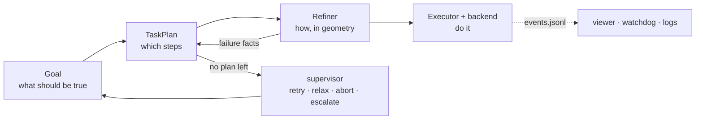
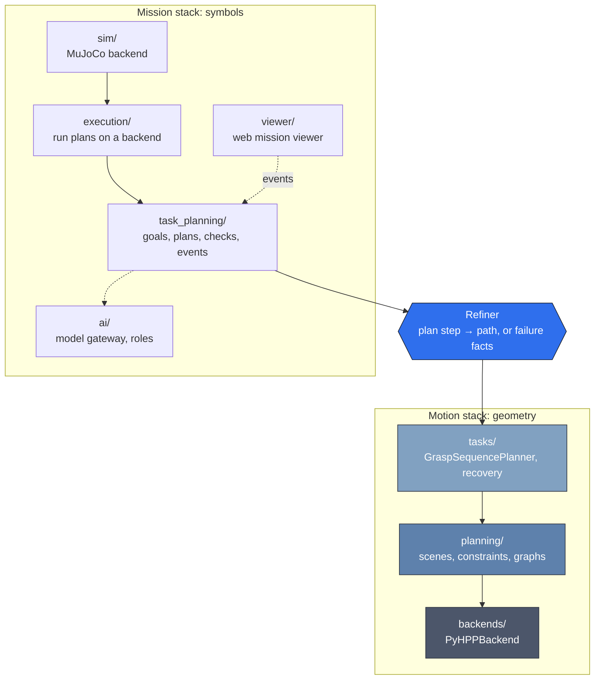

# Long-TAMP - Long-Horizon Task-and-Motion Planning

Long-horizon, multi-arm task-and-motion planning (TAMP) for manipulation, built on HPP (Humanoid Path Planner).

`long_tamp` plans **long, multi-step manipulation sequences** for **several robot arms** on **many movable objects** in a shared scene. **Motion planning** is HPP's constraint-graph planner, driven through a plain-Python task API. **Task planning** is a declarative task plan compiled to **BehaviorTree.CPP**, for standalone, ROS-free mission execution (see *Task Planning* below).

## Capabilities

- **Long-horizon sequence planning.** `GraspSequencePlanner` chains an arbitrary number of grasp/place/hand-over phases, each with its own minimal phase-local constraint graph, so planning cost grows **linearly (O(N))** with the number of grasps instead of combinatorially (**O(N!)**).
- **Multiple robots & objects.** The scene composes several arms into one shared, mutually-collision-aware planning model — able to act independently, cooperate, or hand off objects — alongside any number of free-flying objects/tools, with grasp legality data-driven via `VALID_PAIRS` so adding one is a config change.
- **Reproducibility, introspection & crash recovery.** Crash-safe JSONL run logging plus a path-capture mechanism (`PathRecorder`) record every phase/edge/path so a run can be replayed, continuity-checked, and checkpointed/resumed rather than replanned from scratch.
- **Declarative task planning → BehaviorTree.CPP.** A versioned, capability-checked task plan (`tasks/task_planning/`) compiles deterministically to a BehaviorTree.CPP tree, run by a standalone C++ host through an embedded-CPython bridge with no ROS and no network hop (see *Task Planning* below).
- **Scene visualization.** Interactive 3D viewers: browser-based **viser** (default, no X11) or **gepetto-viewer** (Qt).

## Installation

`long_tamp` has two dependency tiers: a pure-Python tier, and the HPP native bindings
(`hpp-python`, `hpp-toppra`, `hpp-gepetto-viewer`) — C++ extension modules.

| Platform | Pure-Python tier (`pip install -e .`) | HPP native bindings |
|---|---|---|
| Linux x86_64/aarch64 | ✅ PyPI | ✅ PyPI — `pip install -e ".[hpp,toppra]"` |
| macOS | ✅ PyPI | ❌ no wheels (PyPI, conda-forge, robotpkg) — needs Docker/Linux |
| Windows | untested | untested — likely needs Docker/WSL2 |

On Linux, everything installs from PyPI in one command, no system packages or Docker
required. Elsewhere, the pure-Python tier still installs natively via pip, but the planner
itself needs a Linux environment for the native bindings — see
[`docs/INSTALL.md`](docs/INSTALL.md) for the robotpkg/source-build/Docker fallback, the
CMake install path, the NumPy ABI pitfall (robotpkg wants NumPy 1.x, the PyPI wheels want
NumPy 2.x — don't mix them), and runtime backend detection.

## Usage

Writing a task means implementing `ManipulationTask`'s lifecycle contract (`get_objects()`,
`create_constraints()`, `create_graph()`, `build_initial_config()`,
`generate_configurations()`, then `setup()` / `run()`) — either by hand, or, for new tasks,
via a declarative YAML config (recommended). Full, runnable examples live in
[`docs/usage/standalone-usage.md`](docs/usage/standalone-usage.md) §§4–6 rather than
duplicated here, alongside multi-phase sequences, resume/replay/checkpoints, and backend
selection.

- **Start from a template**: `script/templates/task_config_template.yaml` +
  `task_my_task.py` — copy, fill in the `<PLACEHOLDER>`s, run.
- **Read a real, minimal example**: `script/twin/task_lift_ball.py` (bimanual scene).

### Interactive examples

The screw-assembly, TWIN lift-ball, and IKEA table task runners, plus both task
templates, open Viser before planning. Successful planning blocks play native HPP
paths; the full concatenated path plays at completion. In a terminal, Enter
replays the full path, a path number selects an individual path, and `q` exits.
Use `--no-viewer` for unattended runs and `--viewer-port 8081` to choose the port.
The viewer closes on normal exit or a Python exception. Saved-result replay
remains a separate workflow. BehaviorTree host adapters and asset-generation
utilities are not interactive task runners.

## Package structure & architecture

A mission answers four questions — what should be true, which steps get there, how exactly
in geometry, and do it and watch it — and each is answered by a different part of the code.
Failures loop back as facts the task planner plans around; everything that happens goes to an
event stream the viewer reads.

```mermaid
flowchart LR
    goal["Goal<br/>what should be true"] --> plan["TaskPlan<br/>which steps"]
    plan --> refine["Refiner<br/>how, in geometry"]
    refine --> exec["Executor + backend<br/>do it"]
    refine -- "failure facts" --> plan
    exec -. "events.jsonl" .-> watch["viewer · watchdog · logs"]
    plan -- "no plan left" --> sup["supervisor<br/>retry · relax · abort · escalate"]
    sup --> goal
```

The code splits along the line between symbols (the mission stack: `tasks/task_planning/`,
`execution/`, `sim/`, `ai/`, `viewer/`) and geometry (the motion stack: `tasks/` →
`planning/` → `backends/`, the one place HPP is imported). They meet at the refiner.

```mermaid
flowchart TB
    subgraph mission["Mission stack: symbols"]
        direction TB
        tp["task_planning/<br/>goals, plans, checks, events"]
        execution["execution/<br/>run plans on a backend"]
        ai["ai/<br/>model gateway, roles"]
        sim["sim/<br/>MuJoCo backend"]
        viewer["viewer/<br/>web mission viewer"]
    end
    refiner{{"Refiner<br/>plan step → path, or failure facts"}}
    subgraph motion["Motion stack: geometry"]
        direction TB
        tasks["tasks/<br/>GraspSequencePlanner, recovery"]
        planning["planning/<br/>scenes, constraints, graphs"]
        backends["backends/<br/>PyHPPBackend"]
    end
    execution --> tp
    tp -.-> ai
    sim --> execution
    viewer -. events .-> tp
    tp --> refiner
    refiner --> tasks
    tasks --> planning --> backends

    style refiner fill:#2f6fed,stroke:#1d2330,color:#fff
    style backends fill:#4c566a,stroke:#2e3440,color:#fff
    style planning fill:#5e81ac,stroke:#2e3440,color:#fff
    style tasks fill:#81a1c1,stroke:#2e3440,color:#fff
```

Both diagrams are copied from **[`docs/architecture.md`](docs/architecture.md)**, which is the
maintained source — it's dated at the top and follows one mission through the code, covers
failure recovery, models, processes and dependency rules, and maps every module. An
[interactive tour](docs/architecture-tour.html) (open it in a browser) tells the same
story with diagrams you can step through. If the two ever disagree, trust
`docs/architecture.md` and update this copy to match.

## Task Planning (BehaviorTree.CPP)

Alongside the plain-Python `ManipulationTask` API, `tasks/task_planning/` is a second,
declarative entry point: a versioned JSON **TaskPlan IR** (`sequence` / `fallback` / `retry` /
`condition` / `operation` / `transaction` nodes), validated against a `CapabilityRegistry`,
compiles deterministically to a **BehaviorTree.CPP** tree. A standalone C++ host
(`examples/behaviortree/`) runs that tree via an in-process, embedded-CPython bridge — one
process, no ROS, no network hop. It ships with built-in checkpoint/resume and path-capture
validation for long, restartable missions, and is the intended integration point for a future
model-proposed (VLM/LLM) plan.

| Stage | File |
|-------|------|
| IR validation & fingerprinting | `tasks/task_planning/model.py` (`TaskPlan`) |
| Capability policy | `tasks/task_planning/capabilities.py` (`CapabilityRegistry`) |
| IR → BT XML compiler | `tasks/task_planning/compiler.py` |
| C++ host + CPython bridge | `examples/behaviortree/` |

Build with `-DBUILD_BEHAVIORTREE_EXAMPLES=ON`. Full IR schema, the compiler's node mapping,
build/run steps, checkpointing, and how to add a mission or capability:
[`docs/usage/behaviortree-integration.md`](docs/usage/behaviortree-integration.md).

## Run Logging

`long_tamp` includes a structured run logger that writes a crash-safe JSONL event
stream for every planning run — one event per phase/edge attempt, plus a JSON snapshot and a
replay-ready YAML on close. Use it to replay configurations, debug failures, and audit
results.

Logging is **on by default** for every `ManipulationTask` (`log_dir="auto"` creates
`/tmp/long_tamp/<task_slug>_<timestamp>/`; pass an explicit path to redirect it, or
`None` to disable). `RunLogger` also works standalone, independent of `ManipulationTask`.

| Event | When emitted |
|-------|-------------|
| `run_start` | `ManipulationTask.__init__` (with `log_dir`) |
| `config_snapshot` | `setup()` — full `BaseTaskConfig` + setup params |
| `sequence_start` | Start of `plan_sequence()` — all call params + `q_init` |
| `phase_start` | Before each grasp phase — `gripper`, `handle`, `q_start` |
| `edge_start` | Before each transition edge attempt |
| `edge_end` | After each edge — `success`, timing, `q_to` or `error` |
| `phase_end` | After each phase — timing, `state_after`, saved files |
| `run_end` | On normal return or `KeyboardInterrupt` |

For runnable examples — standalone use, inspecting a log afterward
(`print_run_summary`/`load_run_log`/`get_replay_config`), and configuring the underlying
Python `logging` hierarchy — see [`docs/usage/standalone-usage.md`](docs/usage/standalone-usage.md) §10.

## Documentation

- **Installation**: [`docs/INSTALL.md`](docs/INSTALL.md) — pip (primary), robotpkg/source-build fallback, CMake install path, optional extras, backend detection.
- **Architecture**: [`docs/architecture.md`](docs/architecture.md) — module layering, dependency rules, mission and planning data flow. Dated at the top; check it before trusting a claim about what exists.
- **Usage guide (living reference)**: [`docs/usage/standalone-usage.md`](docs/usage/standalone-usage.md) — writing a task, multi-phase sequences, resume/replay/checkpoints, backends, example scripts.
- **Development report**: [`docs/legacy/report/development-report.md`](docs/legacy/report/development-report.md) — *why* the framework is built this way: architecture decisions vs. bare HPP, measured before/after numbers, project timeline, and a bugs-found appendix. A point-in-time report, not a living reference.
- **Design rationale for specific mechanisms**: [`docs/features/`](docs/features/); **upstream HPP defects worked around here**: [`docs/bugs/`](docs/bugs/).
- **API Reference**: See docstrings in source files.
- **ROS-free BehaviorTree.CPP integration**: [`docs/usage/behaviortree-integration.md`](docs/usage/behaviortree-integration.md).

## License

MIT - See [LICENSE](LICENSE) file

---

**Last Updated**: 2026-09-02
