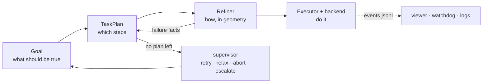
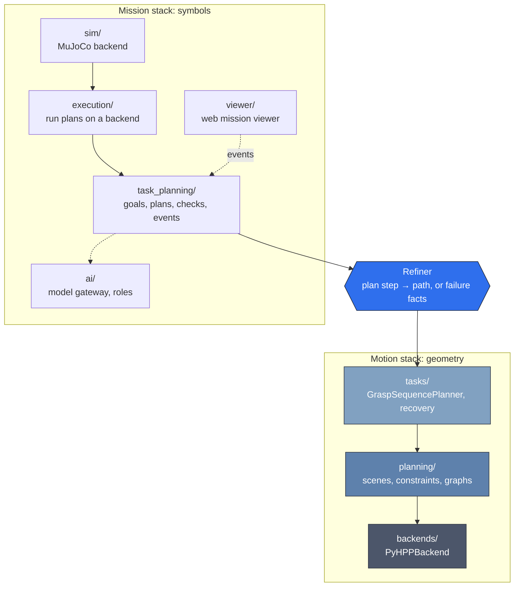
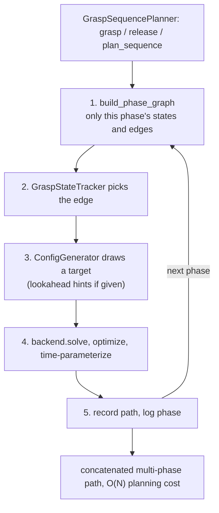

# Architecture

**Last reviewed against source:** 2026-10-05, commit `c23a995` (after 0.8.0). If a module
isn't mentioned here, check `git log --since=2026-10-05 -- src/long_tamp` before assuming
it's missing rather than undocumented.

!!! tip "Interactive tour"
    The same story as this page, with diagrams you can step through: follow one mission
    from instruction to motion, watch the recovery ladder fire, compare graph sizes.
    **[Open the architecture tour](architecture-tour.html)** (one self-contained page, works
    offline).

This page explains how long_tamp is put together and why. It starts with the big picture,
follows one mission through the code, then covers failure handling, models, processes and
the rules that keep the layers apart. The [module map](#module-map) at the end lists where
everything lives. How to *use* each part is under [Usage](usage/README.md); the reasons
behind the big decisions are the [ADRs](adr/README.md).

## The short version

A long-horizon manipulation mission has to answer four questions. long_tamp gives each one
to a different part of the code, and each part hands a checked result to the next.

| Question | Answered by | It produces |
|---|---|---|
| **What should be true at the end?** | a person, or a model through the goal writer | a *goal*: literals such as `screwed(part1, part1/h_hole1)` |
| **Which steps get there?** | a task planner (Fast Downward, Unified Planning, or a hand-written plan) | a *TaskPlan*: a validated tree of capability calls |
| **How exactly, in geometry?** | the **refiner**: `GraspSequencePlanner` on HPP | grasps, configurations and collision-free paths |
| **Do it, and watch it** | an executor (Python, or BehaviorTree.CPP) and an execution backend | motion on a robot or simulator, and an **event stream** |

Two loops close it. When geometry fails, the refiner reports *why* as facts, and the task
planner plans around them. When that runs out, a supervisor decides at goal level (retry,
relax the goal, abort, or hand over to a human). Everything that happens is written to the
event stream, which the viewer, the watchdog and the logs read.

## Two stacks, one seam

The code splits along the line between **symbols** and **geometry**
([ADR-0001](adr/0001-planner-refiner-executor.md)).

- The **mission stack** reasons about symbols: which gripper holds which handle, which
  screw is in. It plans, validates, executes and records. It never imports HPP, so the plan
  format, the compiler, the C++ host and the viewer all work without it.
- The **motion stack** reasons about geometry: constraint graphs, configurations, paths. It
  is the part that took the most work, and it knows nothing about plans or goals.
- They meet at the **refiner**. A plan step goes in (`grasp(ur10_left/gripper,
  part1/h_grasp)`); a path comes out, or facts about why there isn't one
  (`ik_unreachable`, `blocks(part1, clamp2)`). That is the whole interface.

A mission connects the two in its own adapter, outside the library: its capabilities call
`GraspSequencePlanner.grasp()` / `.release()` or a `Refiner`. The screw assembly's adapter
is `script/screw_assembly/screw_bt_session.py`.

## Following one mission

The reference mission ([ADR-0003](adr/0003-screw-assembly-reference-track.md)): two UR10
arms with Robotiq grippers fasten plates to a jig, two screws per plate. Here is what runs,
in order.

1. **Scene.** `build_scene.py` writes URDF/SRDF and a task YAML. `YamlTaskLoader` reads it;
   `SceneBuilder` loads robots, jig and parts into `PyHPPBackend`.
2. **Instruction → goal** (optional). "Assemble part 1 and put the driver away" goes to the
   goal writer (`task_planning/language.py`). The model writes only goal literals; they are
   checked for syntax, known predicates and objects, and reachability. If they fail, the
   reasons go back to the model; if the model can't help, the mission asks for a goal.
3. **Goal → plan.** `pddl.to_pddl()` exports the capabilities (`grasp`, `release`,
   `clamp_and_screw`, `rack`, `home`, with preconditions and effects), the current world
   state and the goal. Fast Downward returns a sequence of calls; `skeleton_document()`
   turns it into a `TaskPlan`, and `parallelize()` puts independent arm motions side by side
   ([ADR-0005](adr/0005-partial-order-plans.md)).
4. **Validation.** `TaskPlan.from_dict` checks every call against the `CapabilityRegistry`
   and simulates the plan from the initial state. Every plan passes this gate, whoever
   wrote it.
5. **Run.** `PlanExecutor` walks the plan with `run_plan` (the same semantics as the
   compiled behavior tree). Before each step, a world-state check: if the step's effects
   already hold (a resumed run, a part already screwed) it is skipped
   ([ADR-0002](adr/0002-effects-as-runtime-guards.md)).
6. **Refine.** The step's capability asks `GraspSequencePlanner` for motion. Per phase it
   builds a small constraint graph for just that transition, picks the edge, draws a target
   (with a lookahead so the next phase stays reachable), and solves. See
   [inside a step](#inside-a-step-why-on-not-on).
7. **Execute.** The path goes to the execution backend (MuJoCo, playback, or a robot) under
   `run_command`: retries while busy, heartbeats, a deadline scaled to the path's duration
   ([ADR-0004](adr/0004-execution-contract.md)). Before it runs, a drift check compares the
   robot with the path's start and replans if they differ. With `plan_ahead`, the next step
   plans while this one moves.
8. **Record.** Effects that no sensor can see later (a screw driven) are recorded only after
   the motion ran. Every status change goes to `events.jsonl`.

The same plan can instead be compiled to BehaviorTree.CPP XML and run in a C++ host, which
calls back into the same Python session and writes the same events. See
[BehaviorTree.CPP integration](usage/behaviortree-integration.md).

## Inside a step: why O(N), not O(N!)

HPP plans manipulation on a *constraint graph*: a node per grasp state ("left gripper holds
part 1"), an edge per transition. One graph over every combination of grippers and handles
grows factorially with the number of grasps, and most of it is never visited.

`GraspSequencePlanner` builds a new, minimal graph for each phase instead.
`SequentialConstraintGraphFactory` keeps only the states and edges on the planned sequence
(`SequentialGraspFilter`), so the total work grows linearly with the number of phases.
`GraspStateTracker` remembers what is held and names the edge to take next; joints of arms
not involved in the phase are locked.

The **lookahead** (`find_feasible_phase_target`) handles a failure this creates: a target
that is fine for phase N can leave the object in an orientation phase N+1 can't grasp. The
lookahead tries candidates for N on a copy of the tracker and keeps one from which N+1 is
reachable. See [phase-target lookahead](features/phase-target-lookahead.md).

## When something fails

Failures are handled at the lowest level that can fix them, and each level only escalates
what it can't.

| Level | Where | What it can change |
|---|---|---|
| 1. Redraw the target | inside `plan_sequence()` | another target for the same edge |
| 2. Resume the block | `block_recovery`, `resume_sequence()` | replan the failing phase, keep earlier phases |
| 3. Replan the block | `block_recovery` | undo the block's earlier commitments, new lookahead |
| 4. Replan the mission | `repair.plan_execute_repair()` | block the failing binding (`clamp2 can't take part1`) and plan around it |
| 5. Decide at goal level | `supervisor.py` (a model role) | retry, drop part of the goal, abort, or escalate |
| 6. A human | escalation report | anything |

Levels 1–4 are deterministic. The refiner turns a geometric failure into facts
(`cannot_reach`, `ik_unreachable`, `release_infeasible`, `lookahead_failed`, `blocks`), and
the task planner treats them as constraints. Only when no plan avoids them does a model get
a say, and only at goal level.

A crash is a failure too. Because completion is checked against the world state, a killed
mission restarts by running the same plan again: finished steps are skipped and the
interrupted one is redone (`kill_resume.py` checks this).

## Models propose, long_tamp checks

Language models are optional, and they never produce motion or plan steps
([ADR-0006](adr/0006-ai-model-integration.md)). Every use goes through the same loop in
`ai/roles.py`: the model proposes, a deterministic checker accepts or gives reasons, the
reasons go back for a bounded number of rounds, and a model-free fallback applies after
that.

| Role | Proposes | Checked by |
|---|---|---|
| Grounder | which scene objects an instruction means | known objects |
| Goal writer | goal literals | syntax, vocabulary, the task planner finding a plan |
| Plan reviewer | constraints, blocked bindings (never steps) | the planner validating them |
| Execution supervisor | retry / relax goal / abort / escalate | allowed actions; a relaxed goal must be a strict subset |
| Step watchdog | wait / skip / abort a slow step | a hard time limit the model can't extend |
| Operator chat | tool calls (plan, run, pause, block, …) | each tool's own argument checks |

`ai/` is one gateway to any Anthropic- or OpenAI-compatible API (`<api>:<model>`); every
call is recorded in the event stream with its tokens and latency. See
[AI models](usage/ai-models.md).

## What runs where

HPP planning holds Python's interpreter lock for seconds at a time. Anything that must stay
responsive while a step plans therefore runs in its own process:

| Process | Runs | Why separate |
|---|---|---|
| Mission | executor, refiner, HPP | the main process |
| Simulator (`ProcessBackend`) | MuJoCo backend | in a thread, MuJoCo motion ran 3.6× slower than real time |
| Viewer front (`separate_process=True`) | page and event serving | the page answers in milliseconds instead of seconds |
| 3D scene (`SceneProcess`) | Viser scene | doesn't freeze while a step plans |
| C++ host (optional) | BehaviorTree.CPP tree | calls Python in-process (embedded CPython), no RPC |

They talk through the event stream (a JSONL file), pipes, a local socket for scene frames,
and HTTP for the viewer's controls, which act on `ExecutionControl` at step boundaries.

## Dependency rules

What the imports look like (checked at the review commit):

- `tasks/task_planning/` imports only `ai/` and `grasping/` from the package. Missions
  connect it to the motion stack in their own adapters, loaded lazily by `host.py`.
- `execution/` depends on `task_planning/` (events, `run_plan`, skills), never on
  `planning/` or `backends/`. Motion reaches it as opaque commands.
- `sim/` implements `execution/`'s contract; `viewer/` only reads events.
- Motion stack: `tasks` → `planning` → `backends`. Known lazy exceptions: `backends/pyhpp.py`
  imports `planning.constraints` and `visualization` inside functions; `tasks/` imports
  `execution.activity` to report progress while planning.
- `backends/` is the only place `pyhpp` is imported, behind `try/except ImportError`
  (`HAS_PYHPP`). The pure-Python tier installs and runs without HPP; HPP, TOPPRA, Unified
  Planning, MuJoCo and model SDKs are extras (`hpp`, `toppra`, `planning`, `sim`, `ai`).

## Module map

| Package | Its job | Main types | Docs |
|---|---|---|---|
| `backends/` | the one HPP binding | `BackendBase`, `PyHPPBackend`, `create_planner` | [Install](INSTALL.md) |
| `planning/` | scenes, constraints, graphs, configs, path recording | `SceneBuilder`, `ConstraintBuilder`, `GraphBuilder`, `SequentialConstraintGraphFactory`, `GraspStateTracker`, `ConfigGenerator`, `PathRecorder` | [Standalone usage](usage/standalone-usage.md) |
| `tasks/` | multi-phase grasp sequences, recovery, the refiner | `GraspSequencePlanner`, `run_block_with_recovery`, `Refiner`, `GraspSequenceRefiner`, `MissionCheckpoint`, `ManipulationTask` | [Refiner](usage/refiner.md) |
| `tasks/task_planning/` | plan format, validation, task planners, repair, BT compiler, events, model roles | `TaskPlan`, `CapabilityRegistry`, `TaskPlanningSession`, `run_plan`, `to_pddl`, `FastDownwardPlanner`, `plan_execute_repair`, `compile_behavior_tree`, `SkillSpec` | [Task planning](usage/task-planning-pddl.md), [Events](usage/events.md), [Skills](usage/skills.md) |
| `execution/` | run plans and motion on a backend | `PlanExecutor`, `ExecutionBackend` contract, `run_command`, `ExecutionControl`, `ProcessBackend`, `StepWatchdog` | [Execution](usage/execution.md) |
| `sim/` | MuJoCo scene export and backend | `export_mjcf`, `MuJoCoBackend` | [Simulation](usage/simulation-mujoco.md) |
| `ai/` | model gateway, roles, operator chat | `make_client`, `refine`, `ModelRole`, `ChatSession` | [AI models](usage/ai-models.md) |
| `viewer/` | web mission viewer, live or replay | `ViewerServer`, `write_replay`, `ChatBridge`, `ViewerConfig` | [Mission viewer](usage/viewer.md) |
| `grasping/` | where to grasp, how far fingers close | `GraspPlanner`, `ParallelGripperModel`, `FingerClosureTable` | |
| `config/` | YAML task configs | `YamlTaskLoader`, `BaseTaskConfig` | |
| `visualization/` | graph diagrams, frames, video, 3D scene process | `SceneProcess`, `MissionViewer`, `VideoRecorder` | |
| `logging/` | run log for script-style tasks, `logging` setup | `RunLogger`, `load_run_log` | [Logging](features/logging-verbosity.md) |
| `utils/`, `cli/` | transforms, terminal menus, shared CLI arguments | | |
| `examples/behaviortree/` (C++) | BT.CPP nodes, plugin, Python bridge, host | `long_tamp_bt_nodes`, `PythonTaskSession`, `agimus_taskplan_bt` | [BT.CPP](usage/behaviortree-integration.md) |

## Reference missions and validation

Missions live in `script/`, built from the library, never inside it.

- **Screw assembly** (`script/screw_assembly/`): the reference track. `task_screw_assembly.py`
  runs it (`--backend none|mock|playback|mujoco`, `--replan`, `--inject-failure`,
  `--resume`, `--chat`, `--instruction … --supervise`); `mission_ui.py` opens the mission UI
  (instruction, plan card, Start/Reset, live plan monitor). Gates: `summarize.py --gate`
  (V3 batch), `scenarios.py` and `kill_resume.py` (V4), `concurrency_ab.py`,
  `autonomy_batch.py` (M6). Robot models come from Universal Robots' and PickNik's official
  descriptions.
- **TWIN lift ball** (`script/twin/`), **IKEA LACK table** (`script/ikea_table_prototype/`),
  **grasp planning** (`script/grasp_planning/`), and `script/templates/` for a new task.

Validation levels V0–V4 and which change needs which: [Validation](development/validation.md).

## Extension points

- **A mission:** a YAML scene, a capability registry, and a session adapter whose
  capabilities call `grasp()` / `release()` or a `Refiner`. Register a factory in `host.py`
  to run it from a C++ host.
- **A task planner:** anything that returns a `TaskPlan` document (the `TaskPlanner`
  protocol for PDDL-style planners). It passes the same validation.
- **An execution backend:** `start` / `poll` / `cancel` from `execution.contract`; wrap it
  in `ProcessBackend` to run it in its own process.
- **A skill:** a `SkillSpec` on the capability, and a controller in a backend that runs it.
- **A model role:** input, JSON output schema with a parser, a checker and a fallback, run
  through `ai.roles.refine`.
- **An HPP binding:** implement `BackendBase`, register it in `backends/__init__.py`.

## Out of scope

long_tamp has no ROS 2 nodes, topics or launch files. A ROS 2 stack uses it through
BT.CPP nodes with a ROS-backed `TaskSession`, or an execution backend that is an action
client; that integration lives in the consumer. `CMakeLists.txt` and `package.xml` exist to
install next to an HPP source build and to build the BT.CPP examples; they add no ROS 2
runtime dependency to the Python code.
