# Development workflow

How a change goes from an idea to a release in `long_tamp`. It applies to every
contributor, human or agent. The screw-assembly example (`script/screw_assembly/`)
is the reference mission every behavioural change is validated against: see
[validation.md](validation.md).

```mermaid
flowchart LR
  A[Roadmap milestone] --> B[Issue]
  B -->|design-level?| C[ADR]
  B --> D[Branch]
  C --> D
  D --> E[Implement + tests]
  E --> F[Validate V0-V4]
  F --> G[PR: docs + CHANGELOG]
  G --> H[CI green + review]
  H --> I[Squash-merge into dev, delete branch]
  I --> J[Close issue, tick roadmap]
  J -->|milestone done| K[Milestone gate on dev]
  K --> L[Release PR dev to main, tag]
  L --> M[Back-merge main to dev]
```

## Branches

| Branch | Role | Receives |
|---|---|---|
| `main` | Released code. What PyPI and the docs site reflect. Tags `vX.Y.Z` are cut here. | Release PRs from `dev`, hotfix PRs |
| `dev` | Integration branch. All roadmap work lands here first. | Squash-merged feature/fix PRs |
| `feature/<issue>-<slug>`, `fix/…`, `refactor/…`, `docs/…`, `chore/…` | One issue (or a coherent part of one) | — |

- Feature work branches from `dev` and opens its PR **against `dev`**.
- A **release PR** `dev → main` is opened when a milestone's gate passes (or for a
  patch release). It is merged with a **merge commit**, not squashed, so `dev` and
  `main` keep a shared history and the next release PR has no spurious conflicts.
- **Hotfix:** `fix/<issue>-<slug>` from `main`, PR against `main`, patch release, then
  merge `main` back into `dev`.
- `main` is GitHub's default branch, and closing keywords (`Closes #N`) only act on
  merges into the default branch. After a PR merges into `dev`, **close its issue
  explicitly**: `gh issue close N -c "Done in #<PR> (on dev)"`.

## 1. Plan: roadmap → issue

- The roadmap ([plans/roadmap.md](../plans/roadmap.md)) is split into **milestones**,
  each a GitHub milestone with a release version. Work items are **GitHub issues**
  attached to a milestone. Work that isn't on the roadmap starts as an issue too.
- Open issues with the templates (feature / bug). Every issue states:
  - the problem and the **acceptance criteria** (what "done" means, testable);
  - the **validation level** it needs (V0–V4, see [validation.md](validation.md));
  - whether it changes user-visible behaviour (CHANGELOG, docs).
- Labels: one `type:*`, one or more `area:*`, optionally `priority:*`.
  `needs-batch-gate` marks work that must pass the screw-assembly batch gate before
  merging.
- **Design-level decisions get an ADR first** ([adr/](../adr/README.md)): a new
  public interface, a new module boundary, a new dependency, or a change to the plan
  IR schema. The ADR can land in its own PR or in the first PR of the feature.

## 2. Branch

`feature/<issue>-<slug>`, `fix/<issue>-<slug>`, `refactor/…`, `docs/…`, `chore/…`,
from an up-to-date `dev` (hotfixes: from `main`). Keep branches short-lived: one issue, or a coherent part of
one, per PR. A milestone is delivered by several PRs, not one.

## 3. Implement

- Tests come with the code, in the same PR. New behaviour gets a test that fails
  without it; a bug fix gets a regression test.
- Tests that need HPP but not a full planning run go in the normal suite. Real-scene
  planning checks are marked `@pytest.mark.slow_planning` (run nightly).
- Commits follow Conventional Commits (`type(scope): description`); the body says why.
- Keep `task_planning/` free of mission-specific code: missions live in `script/`.

## 4. Validate

Run the levels your change requires, from [validation.md](validation.md):
V0 locally before every push, V1 is CI, V2 (smoke mission) for anything that can
change planning, V3 (batch gate) for `needs-batch-gate` work and milestone closure,
V4 (initial-state scenarios) from milestone M1 on. Record V3/V4 results as files, not
only as PR text.

## 5. Document

In the **same PR** as the code:
- `CHANGELOG.md`: an entry under `[Unreleased]` for any user-visible change (Added /
  Changed / Deprecated / Removed / Fixed). Pure refactors, tests and CI changes don't
  need one; label the PR `skip-changelog`.
- `docs/usage/` is the living reference. Update it when the public API changes.
- New pages go into `mkdocs.yml`'s `nav`. CI builds the site with `--strict`, so a
  broken link or a missing nav entry fails the PR.
- Architecture-level changes update `docs/architecture.md` and, if a decision changed, the
  relevant ADR (supersede it; don't rewrite history).

## 6. Pull request → merge

Open the PR **against `dev`** with the template (`Closes #<issue>`). The merge conditions and the
drive-to-green procedure are in `.claude/skills/dev-maintain-release-workflow/SKILL.md`
and apply to everyone:

- every required check green on the current head (`lint`, `lint-style` advisory,
  `test-standalone`, `test-hpp`, `distribution`, `docs`, `changelog`);
- no conflict with `dev`, every review thread answered, no "changes requested";
- the validation evidence the issue asked for is in the PR;
- **squash-merge** into `dev` with the Conventional Commits title, then delete the branch.

Never skip, disable or quarantine a test to get green.

## 7. After merge

- Close the issue with a link to the PR (`Closes #N` doesn't fire on merges into
  `dev`, see Branches).
- If the merged work completes a roadmap item, tick it in
  [plans/roadmap.md](../plans/roadmap.md) (it can be part of the PR itself).
- A milestone closes only when its **exit test** passes and the result files are
  committed (see the milestone gate in [validation.md](validation.md)).

## 8. Release

Each completed milestone is a minor release (`0.x.0`). Patch releases (`0.x.y`) carry
fixes only. In order:

1. On `dev` (through a PR): bump the version (`pyproject.toml`, `version.py`,
   `__init__.py`, `package.xml`) and move `CHANGELOG` `[Unreleased]` into a dated section.
2. Release PR `dev → main`, with the milestone's V3 (and V4) result files linked; merge it
   with a **merge commit**.
3. Tag `vX.Y.Z` on `main`. That runs `release.yml`; approve the `pypi` deployment.
4. Publish the GitHub release (notes from the changelog); close the milestone.
5. **Back-merge:** PR `main → dev`, merged with a merge commit (no file changes). It gives
   `dev` the release merge commit, so `dev` always contains `main` and `main` only trails
   `dev`. Skipping it leaves the two "1 ahead, 1 behind" each other after every release.

## Definition of done

A change is done when all of these hold:

- [ ] Acceptance criteria of the issue met, tested
- [ ] Required validation levels run, results recorded (V3/V4 as files)
- [ ] `CHANGELOG.md` entry (or `skip-changelog` with a reason)
- [ ] Docs updated; `mkdocs build --strict` passes
- [ ] ADR written or updated if a design decision changed
- [ ] PR squash-merged into `dev`, branch deleted, issue closed, roadmap ticked
