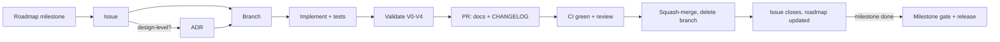

# Development workflow

How a change goes from an idea to a release in `long_tamp`. It applies to every
contributor, human or agent. The screw-assembly example (`script/screw_assembly/`)
is the reference mission every behavioural change is validated against: see
[validation.md](validation.md).

## 1. Plan: roadmap → issue

- The roadmap ([plans/roadmap.md](../plans/roadmap.md)) is split into **milestones**,
  each a GitHub milestone with a release version. Work items are **GitHub issues**
  attached to a milestone. Work that isn't on the roadmap starts as an issue too.
- Open issues with the templates (feature / bug). Every issue states:
  - the problem and the **acceptance criteria** (what "done" means, testable);
  - the **validation level** it needs (V0–V4, see [validation.md](validation.md));
  - whether it changes user-visible behaviour (CHANGELOG, docs).
- Labels: one `type:*`, one or more `area:*`, optionally `priority:*`.
  `needs-batch-gate` marks work that must pass the screw-assembly batch gate before
  merging.
- **Design-level decisions get an ADR first** ([adr/](../adr/README.md)): a new
  public interface, a new module boundary, a new dependency, or a change to the plan
  IR schema. The ADR can land in its own PR or in the first PR of the feature.

## 2. Branch

`feature/<issue>-<slug>`, `fix/<issue>-<slug>`, `refactor/…`, `docs/…`, `chore/…`,
from an up-to-date `main`. Keep branches short-lived: one issue, or a coherent part of
one, per PR. A milestone is delivered by several PRs, not one.

## 3. Implement

- Tests come with the code, in the same PR. New behaviour gets a test that fails
  without it; a bug fix gets a regression test.
- Tests that need HPP but not a full planning run go in the normal suite. Real-scene
  planning checks are marked `@pytest.mark.slow_planning` (run nightly).
- Commits follow Conventional Commits (`type(scope): description`); the body says why.
- Keep `task_planning/` free of mission-specific code: missions live in `script/`.

## 4. Validate

Run the levels your change requires, from [validation.md](validation.md):
V0 locally before every push, V1 is CI, V2 (smoke mission) for anything that can
change planning, V3 (batch gate) for `needs-batch-gate` work and milestone closure,
V4 (initial-state scenarios) from milestone M1 on. Record V3/V4 results as files, not
only as PR text.

## 5. Document

In the **same PR** as the code:
- `CHANGELOG.md`: an entry under `[Unreleased]` for any user-visible change (Added /
  Changed / Deprecated / Removed / Fixed). Pure refactors, tests and CI changes don't
  need one; label the PR `skip-changelog`.
- `docs/usage/` is the living reference. Update it when the public API changes.
- New pages go into `mkdocs.yml`'s `nav`. CI builds the site with `--strict`, so a
  broken link or a missing nav entry fails the PR.
- Architecture-level changes update `ARCHITECTURE.md` and, if a decision changed, the
  relevant ADR (supersede it; don't rewrite history).

## 6. Pull request → merge

Open the PR with the template (`Closes #<issue>`). The merge conditions and the
drive-to-green procedure are in `.claude/skills/dev-maintain-release-workflow/SKILL.md`
and apply to everyone:

- every required check green on the current head (`lint`, `lint-style` advisory,
  `test-standalone`, `test-hpp`, `distribution`, `docs`, `changelog`);
- no conflict with `main`, every review thread answered, no "changes requested";
- the validation evidence the issue asked for is in the PR;
- **squash-merge** with the Conventional Commits title, then delete the branch.

Never skip, disable or quarantine a test to get green.

## 7. After merge

- The issue closes through `Closes #N`. If it didn't, close it with a link to the PR.
- If the merged work completes a roadmap item, tick it in
  [plans/roadmap.md](../plans/roadmap.md) (it can be part of the PR itself).
- A milestone closes only when its **exit test** passes and the result files are
  committed (see the milestone gate in [validation.md](validation.md)).

## 8. Release

Each completed milestone is a minor release (`0.x.0`), following the release process
in the dev skill: version bump, `CHANGELOG` `[Unreleased]` → dated section, tag
`vX.Y.Z`, trusted publishing, GitHub release notes from the changelog. Patch releases
(`0.x.y`) carry fixes only. The release commit must carry a V3 batch result.

## Definition of done

A change is done when all of these hold:

- [ ] Acceptance criteria of the issue met, tested
- [ ] Required validation levels run, results recorded (V3/V4 as files)
- [ ] `CHANGELOG.md` entry (or `skip-changelog` with a reason)
- [ ] Docs updated; `mkdocs build --strict` passes
- [ ] ADR written or updated if a design decision changed
- [ ] PR merged by squash, branch deleted, issue closed, roadmap ticked
