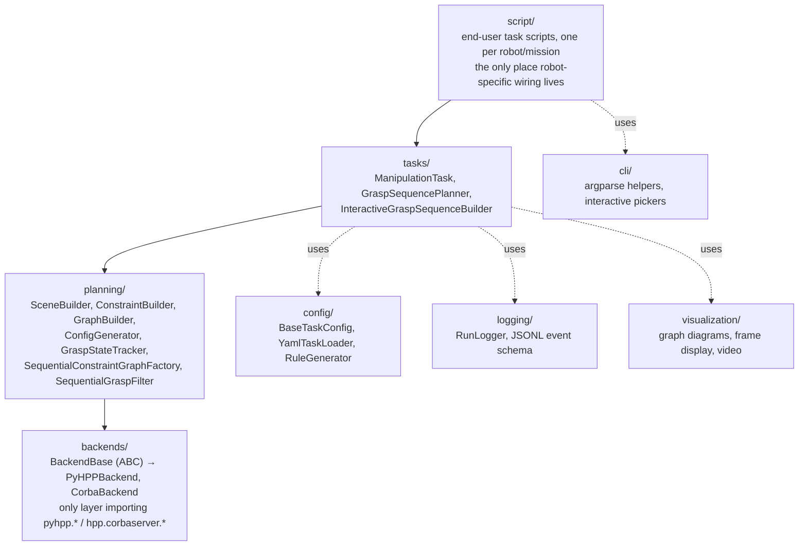
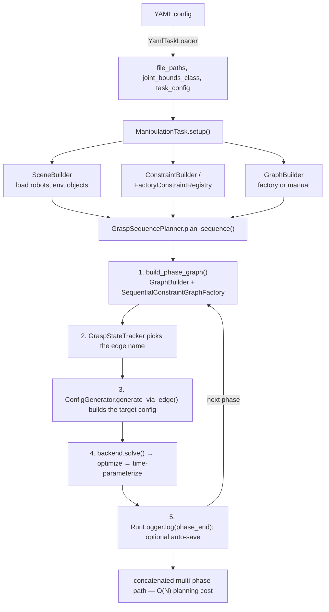

# agimus_spacelab — Development & Engineering Report

How a task/orchestration layer built on top of HPP (Humanoid Path Planner) turns a
high-level SpaceLab assembly goal into one collision-free motion for several robot arms —
the decisions that made it faster and more reliable than planning against bare HPP, and a
guide to building a mission with it.

> **Living reference.** This report is a snapshot. The maintained, continuously-updated
> usage reference is [`standalone-usage.md`](../usage/standalone-usage.md) (plus
> [`dbt-integration.md`](../usage/dbt-integration.md) for the ROS 2 / Dynamic-Behavior-Tree consumer
> built on top of this same library) — when the two disagree, trust that doc, not this one.
> It's also explicit about a stale reference elsewhere in the repo:
> `src/agimus_spacelab/__init__.py`'s docstring mentions
> `TaskOrchestrator`/`TaskBuilder`/`PlanningBridge`, none of which exist.
> (`script/spacelab/README.md` was rewritten and is now current, scoped to the SpaceLab setup
> specifically.) This report cites `script/spacelab/README.md` once, in §04.8, and only for a
> historical lines-of-code comparison predating that rewrite.

**At a glance**

| | |
|---|---|
| Grasp-sequence planning cost vs. sequence length | **O(N!) → O(N)** |
| Constraint-graph construction, 8-gripper phase | **20 min hang → seconds** |
| PyHPP vs. CORBA, hot-path planning calls | **~4.0×** |
| Planner's largest method, same behavior | **1145 → 208 lines** |
| Development span / commit count | **9 months / 473 commits** (Nov '25 – Aug '26) |

## Contents

1. [Overview](#01--overview)
2. [Timeline](#02--timeline)
3. [Architecture](#03--architecture)
4. [Engineering decisions](#04--engineering-decisions)
5. [Performance summary](#05--performance-summary)
6. [Usage guide](#06--usage-guide)
7. [Appendix A — Bugs found & fixed](#07--appendix-a--bugs-found--fixed)
8. [Appendix B — Codebase & open items](#08--appendix-b--codebase--open-items)

---

## 01 · Overview

HPP (Humanoid Path Planner) is a general-purpose C++ constraint-graph manipulation planner,
reachable from Python either through a CORBA server or through direct `pyhpp` bindings. On
its own, HPP answers a narrower question than a SpaceLab assembly mission asks: given one
constraint graph and one start/goal pair, find a path. `agimus_spacelab` is the layer above
that answers the mission-level question — *grasp this, hand it to the other arm, screw it
down, six times, without a human replanning between steps* — by treating HPP as a backend
rather than a fork.

That framing matters for what "better, faster, more efficient" means here. Nothing in this
repository modifies HPP's planning algorithms. What `agimus_spacelab` contributes sits on
four separate axes, and the decisions in §04 are grouped along them:

- **Algorithmic** — restructuring how a multi-grasp mission's constraint graph gets built, so
  cost scales with the number of grasps instead of their combinations.
- **Runtime** — defaulting to the in-process Python bindings over the CORBA server, and
  fixing a real upstream defect that undid a chunk of that gain.
- **Reliability** — replacing silent, unbounded hangs and unrecoverable dead-end commitments
  with bounded, retriable, resumable planning.
- **Usability** — collapsing what used to be an 800-line, hand-wired Python script per robot
  into a declarative YAML file plus a ~200-line task script built from shared,
  independently-tested primitives.

The package itself has no ROS 2 dependency — it is a planning library (`pip install -e .`,
run as ordinary Python scripts) meant to sit underneath a behavior-tree / mission layer, not
a node graph of its own. §03 covers the module layering; §06 is a hands-on guide to building
a mission with it.

---

## 02 · Timeline

Roughly nine months, 473 commits, from a CORBA proof-of-concept to a checkpointed,
resumable, multi-arm screwdriving mission.

| When | What |
|---|---|
| 2025-11 – 12 | **CORBA foundation.** Initial commit ports a "grasp ball in a box" example onto `hpp-manipulation-corba`; the first task-orchestration framework and SpaceLab UR10 tool-grasp task follow within the month. |
| 2026-01 – 04 | **PyHPP lands as a second backend.** Dual CORBA/PyHPP support, a `GraphBuilder` unifying declarative graph definition across both, and a `ConfigGenerator` for waypoint generation. `BackendBase` formalizes the interface so task code stops caring which backend it runs on. |
| 2026-04 – 07 | **Modularization & config-as-data.** `SceneBuilder` / `ConstraintBuilder` / `ConfigGenerator` split out of monolithic task scripts; the YAML-driven `YamlTaskLoader` replaces hand-wired per-robot Python config. `GraspSequencePlanner` is introduced for chained, multi-phase grasp/release/hand-over sequences with resume support. |
| 2026-08-01 – 09 | **Production hardening, round one.** Five stacked wall-clock-hang bugs found and fixed across `agimus_spacelab` and upstream `hpp-core` (§04.4); the constraint-graph-factory memoization defect found and fixed in `hpp-python` (§04.3); a disciplined, container-verified refactor of the 4,500-line `GraspSequencePlanner` (§04.10). |
| 2026-08-13 – 16 | **The screwdriving sequence.** 13-phase assembly extended with a per-part screwdriving stage across six modules. Phase-target lookahead (§04.5), arm-transit robustness fixes, console/file log-verbosity split, checkpoint/resume, and a hand-written per-turn assembly-order table all land in the same push — the most recent, most heavily instrumented mission in the repository. |
| 2026-08-16 – 17 | **Resume correctness.** Most recent commits tighten resume semantics specifically: a failed phase now restarts from where it *began* rather than where it stopped, an attempt's paths are dropped if it never completed, a block replans from its entry once resuming stops making progress, and a finished run's full path is joined into one playable `PathVector` for replay. |

---

## 03 · Architecture

Four layers, strictly downward-dependent, plus horizontal support layers with no dependency
back into task orchestration.


*fig. 1 — module layering, `src/agimus_spacelab`. Dependency direction is strictly downward.*

`backends/` is the only layer that imports HPP-specific bindings. `BackendBase` is an ABC
covering everything a planning primitive needs — robot/environment/object loading,
constraint-graph state/edge creation, path planning and validation, path I/O, visualization —
implemented by `PyHPPBackend` (default) and `CorbaBackend` (deprecated, kept for
back-compat). Both imports are wrapped in `try/except ImportError`, so the pure-Python parts
of the package — config parsing, transforms, run logging, graph visualization — import and
work even with zero HPP bindings installed; a missing backend only raises when something
actually tries to construct it.

`planning/` holds backend-agnostic primitives, each independently usable: `SceneBuilder`
loads robots/environment/objects with a fluent API; `ConstraintBuilder` creates
grasp/placement/complement/locked-joint constraints through one signature for either backend;
`GraphBuilder` builds the constraint graph either via factory (auto-generated from declared
grasp rules) or manually (explicit state/edge calls, for graphs the factory's combinatorial
model doesn't fit); `ConfigGenerator` projects and generates waypoint configurations along
graph edges.

`tasks/` is the orchestration layer: `ManipulationTask` is the lifecycle contract every task
implements (`setup()` → `run()`); `GraspSequencePlanner` — the largest module in the package —
chains an arbitrary-length sequence of grasp/release/hand-over phases into one continuous,
concatenated plan, with pause/resume, checkpointing, and replay.


*fig. 2 — the phase loop that every mission ultimately runs through.*

---

## 04 · Engineering decisions

Ten decisions, roughly in the order they compound: the algorithmic restructuring that made
long missions *possible*, the runtime and reliability work that made them *practical*, then
the usability and process decisions that made them *repeatable*. Each entry states the
baseline it replaced, what changed, and the measured effect — sourced from this repository's
own design docs, bug reports, and refactor logs, not estimated after the fact.

### 04.1 — Phase-local constraint graphs: O(N!) collapsed to O(N)
*axis: algorithmic*

A single monolithic `ConstraintGraphFactory` graph over every possible grasp combination is
HPP's default model, and it is exactly as expensive as it sounds: for a mission with *N*
sequential grasp/place/hand-over phases across several grippers and objects, the number of
reachable grasp combinations grows factorially in *N*. A six-part, multi-hole assembly like
the SpaceLab screwdriving mission never gets a graph built at all under that model.

| | |
|---|---|
| Baseline | one graph over all grasp combinations — O(N!) states/edges |
| Mechanism | `SequentialConstraintGraphFactory` + `SequentialGraspFilter`, invoked per phase via `build_phase_graph()` |

`GraspSequencePlanner` never builds the full combinatorial graph. Each phase gets a fresh,
*minimal* graph restricted to the grippers/handles actually relevant to that phase;
`SequentialConstraintGraphFactory` overrides `transitionIsAllowed()` so only states/edges
reachable along the one planned grasp sequence get built at all, and `SequentialGraspFilter`
answers "is this grasp tuple on the planned path" in O(1) via abbreviated state strings.
Planning cost across a whole mission becomes the sum of *N* cheap phase-local builds instead
of one graph sized to every combination that was never going to be used.

**O(N!) → O(N)**

*Source: `ARCHITECTURE.md` "Design goals"; `src/agimus_spacelab/planning/sequential_graph_factory.py`, `sequential_grasp_filter.py`.*

### 04.2 — In-process PyHPP as the default backend
*axis: runtime*

HPP is reachable two ways from Python: a CORBA server (separate process, string-keyed RPC,
serialize every config/path across the wire) or `pyhpp` — direct pybind11 bindings living in
the same process as the caller. `agimus_spacelab` defaults every task to PyHPP and keeps
CORBA only for back-compat, now marked deprecated.

*Microbenchmark, 10,000 operations, HPP 6.1.0 — internal comparison doc, not a formal published result*

| Operation | CORBA | PyHPP | Speedup |
|---|---:|---:|---:|
| Random config sampling | 1.2 s | 0.3 s | 4.0× |
| Configuration validation | 0.8 s | 0.2 s | 4.0× |
| Constraint evaluation | 1.5 s | 0.4 s | 3.8× |
| Path projection (100 steps) | 2.5 s | 0.8 s | 3.1× |
| Graph state projection | 1.8 s | 0.5 s | 3.6× |
| Simple planning (100 iter) | 5.2 s | 2.1 s | 2.5× |
| Memory, 10k-node plan | ≈1.5 GB (client+server) | ≈0.8 GB (single process) | ≈1.9× |

The gap narrows for long-running planning (2–3×, dominated by compute rather than IPC) and
widens for small, frequent operations (up to 4×, dominated by serialization) — consistent
with the theory: PyHPP's overhead is a function-call, CORBA's is a round trip. What made the
switch safe rather than a rewrite is `BackendBase`: every layer above `backends/` is written
once against the ABC and runs unmodified on either implementation, so this was a
default-argument change, not a migration.

*Source: `docs/legacy/hpp_python_interface/comparison_corba_vs_pyhpp.md`; `ARCHITECTURE.md` "Backends".*

### 04.3 — Fixing the constraint-graph factory's memoization bug upstream
*axis: runtime · upstream*

Even with phase-local scoping (§04.1), the densest phase of a 13-phase sequence — 8 grippers
× 7 objects simultaneously held — stalled `factory.generate()` for 20+ minutes of
genuinely-computing CPU with zero output. Root cause: `GraphFactoryAbstract._recurse()` in
`hpp-python` only memoizes *accepted* grasp combinations; a combination *rejected* by the
grasp filter is re-explored from every distinct order in which grippers/handles can reach it.
This was a real regression from the module's own documented O(N) intent for a restrictive
sequential filter, confirmed by a standalone, HPP-independent reproduction — not inherent
combinatorial cost.

*Standalone repro, `_recurse()` call counts, before/after a one-line fix*

| grippers × handles | buggy | fixed |
|---|---:|---:|
| 2 × 1 | 3 | 3 |
| 4 × 3 | 222 | 73 |
| 6 × 5 | 137,266 | 4,051 |
| 7 × 6 | > 3,000,000 (aborted) | 37,633 |
| 8 × 7 (production worst case) | — (would dwarf 7×6) | 394,353 |

The fix adds a visited-set independent from the existing (differently-scoped) `self.states`
dict, so rejected combinations are marked seen without disturbing the actually-created-states
bookkeeping other code depends on. States and transitions produced were diffed exactly equal
before/after across multiple gripper counts, including an adversarial non-monotonic filter —
only the redundant recursion was eliminated.

**20+ min hang → seconds**

*Source: `docs/bugs/constraint-graph-factory-combinatorial-blowup.md`. Fixed in `hpp-python/src/pyhpp/manipulation/constraint_graph_factory.py`.*

### 04.4 — Systematic wall-clock bounding — ending indefinite hangs
*axis: reliability*

A 13-phase sequential grasp task would occasionally freeze for 30–45+ minutes with zero
output and no crash — indistinguishable from a true infinite loop. Investigation found
**five independent missing-timeout bugs** stacked across the stack, none inherent to the
planning problem's difficulty:

| # | Where | Missing bound |
|---|---|---|
| 1 | `GraspSequencePlanner._plan_release_subphase()` | no retry-on-failure, unlike the main grasp-edge loop |
| 2 | `ConfigGenerator.generate_via_edge()` | attempt-count cap only, no wall-clock timeout |
| 3 | `hpp-core::Astar::findPath()` | no iteration cap, no timeout at all |
| 4 | `continuousValidation::Progressive::validateStraightPath()` | step size can shrink toward zero near tangent collisions |
| 5 | `PathOptimizer::timeOut` | existed but defaulted to infinity and was never set on `innerProblem()` |

Each got a real wall-clock bound (30 s for the A* extraction and the optimizer time-out, 15 s
for continuous validation, checked every 1000 steps to avoid the check itself adding
overhead) plus, for the Python-side retry gap, the same regenerate-and-retry pattern the rest
of the file already used. None of these change what a solvable problem returns — they change
"will hang forever" into "will fail cleanly and get another random seed."

**30–45+ min silent stalls → bounded, ≤400 s worst case demonstrated**

*Source: `docs/bugs/hpp-core-unbounded-planning-loops.md`.*

### 04.5 — Phase-target lookahead — spending planning time to buy back a dead end
*axis: reliability*

Bounding hangs (§04.4) doesn't help when a phase can never succeed at all. Two fixed-offset
grasps on the same rigid object fully determine its orientation; once `frame_gripper` and
`vispa2` both hold a part, its orientation is frozen, and if that orientation happens to be
wrong for the *next* phase's screwdriver grasp, no amount of retrying the next phase can fix
it — it isn't the phase that made the bad choice. Live evidence: RS6's `CON0` grasp failed
**2,300+ consecutive** target-generation attempts, 0% ever reaching collision-checking; RS5
failed 878/878.

`find_feasible_phase_target()` draws a candidate for phase N, commits it on a *throwaway
copy* of the grasp tracker, and probes whether phase N+1 is still reachable before the real
run ever sees that candidate. Only a candidate that passes gets replayed into the real call
as a per-edge warm-start hint chain — hinting only the terminal edge was tried and found
insufficient (a redrawn pregrasp edge silently drifted the validated candidate away from what
was probed), so the whole chain is threaded through, not just the final config.

| | |
|---|---|
| Cost, disclosed | not flat: ~65 ms/candidate early, ~6.2–6.4 s by the point 3 objects are already held |
| Bound | `max_candidates=100` → ≤ 15–20 min worst case |

**2,300+ failures, 0% success → bounded search, reliable commit**

This is a genuine trade, stated honestly rather than presented as a free win: a mission that
used no lookahead was faster whenever it happened to draw a lucky commitment, and
unrecoverable whenever it didn't. Twenty tried as the candidate budget starved the search at
a harder checkpoint; 100 buys headroom at the cost of a worst case that is still an order of
magnitude below the multi-hour blind-retry stalls it replaces.

The lookahead is also why a separate, quieter fix mattered: each candidate does *two* full
`build_phase_graph()` calls (§04.3's factory, probing phase N then phase N+1), so 100
candidates is up to 200 builds per round. Each build's retired `ConstraintGraphFactory`
leaves a small Python reference cycle — `ConstraintFactory` ↔ its own `graphfactory`
back-reference — that pins roughly 235 MB of C++ graph memory until a generation-2 garbage
collection happens to run. Left alone, 200 builds/round is on the order of 45 GB stranded per
round. `GraphBuilder._break_factory_cycle()` cuts that reference explicitly at the end of
every `build_phase_graph()` call instead of waiting on the GC. See Appendix A.

*Source: `docs/features/phase-target-lookahead.md`; `docs/usage/standalone-usage.md` §16.*

### 04.6 — Motion-quality tuning — valid paths that are also usable ones
*axis: execution quality*

A path can be collision-free and constraint-satisfying and still be unusable: full
velocity-limit execution with no safety margin, an optimizer pipeline that smooths before it
shortens (so the shortcut re-kinks an already-smooth curve), and cubic splines too low-order
to fit long multi-via-point transits smoothly. None of these were deliberate choices —
`SimpleTimeParameterization/safety` was simply never set on either backend, defaulting
HPP-core's own `1.0` (100% of joint velocity limits) straight through to execution.

| Parameter | Before | After |
|---|---|---|
| Time-param safety factor | unset → 1.0 (full speed) | tunable, default 0.95, SpaceLab mission uses 0.5 |
| Transit optimizer order (CORBA) | smooth, then shortcut | shortcut first, then smooth |
| Spline order | `bezier3` (cubic) | `bezier5` (quintic) |
| Zero-velocity at state junctions | forced | disabled — velocity now carries through |
| Shortcut attempts/pass | 5 (HPP default) | 50, YAML-overridable |

Framed against §04.2's runtime numbers, this is a deliberately different efficiency axis: not
planning wall-clock, but execution safety and smoothness — the property that actually matters
once a mission is meant to run on hardware rather than only inside a solver.

*Source: `docs/bugs/motion-quality-time-parameterization.md`.*

### 04.7 — Config-as-data: the YAML task loader
*axis: usability*

Before `YamlTaskLoader`, a new robot meant a new Python config module hard-coding URDF paths,
joint names, and valid grasp pairs directly into code the planning framework imported.
`YamlTaskLoader` reads one YAML file and produces everything `SceneBuilder`/`ManipulationTask`
need — no file in the framework needs to know a specific robot's joint or file names, only
the YAML does.

**new robot = new Python module → new robot = one YAML file**

Adding an object or tool to an existing mission is a `valid_pairs` edit in YAML, not a code
change anywhere in `src/`. `script/templates/task_config_template.yaml` and
`task_my_task.py` are fully generic — copy, fill placeholders, run — and
`script/config/graspball_config.yaml` is the minimal real-world proof it isn't just a
template exercise. §06.3 walks through this end to end.

*Source: `ARCHITECTURE.md` "Configuration"; `src/agimus_spacelab/config/yaml_loader.py`.*

### 04.8 — Composable primitives over monolithic task scripts
*axis: usability*

The pre-modularization pattern was one large script per task mixing scene setup, constraint
definitions, graph construction, and configuration generation inline. `SceneBuilder`,
`ConstraintBuilder`, `GraphBuilder`, and `ConfigGenerator` split those concerns into
independently-testable, single-purpose, fluent objects a task composes rather than a
god-object it inherits from.

| | Before | After |
|---|---|---|
| Per-task script | 800+ lines, monolithic | ~500 lines task-specific + ~700 lines shared |
| New task from scratch | copy & hand-modify 800 lines | ~200 lines, framework does the rest |

The shared 700 lines are the leverage: a bug fixed once in `ConfigGenerator` is fixed for
every task that uses it, rather than needing to be re-found and re-patched per copy-pasted
script.

*Source: `script/spacelab/README.md`, "Comparison: Before vs After Refactoring".*

### 04.9 — Reproducibility infrastructure: three independent mechanisms, not one
*axis: operability*

Three separate systems cover three separate failure scopes — worth naming precisely rather
than as one blob, because each answers a different question about a run.

| Mechanism | Answers | Survives |
|---|---|---|
| `RunLogger` (JSONL event log) | "what happened" — every phase/edge attempt, timing, success/failure | process exit; read back post-mortem |
| `resume_sequence()` (in-process) | "continue this planner" after one phase's failure | nothing — same Python session, same object, only |
| `PathRecorder` / `--checkpoint-dir` | "replay this run's motion" without rebuilding any constraint graph | a killed process, a crashed container, a new session entirely |

`RunLogger` is on by default for every `ManipulationTask`. `resume_sequence()` is the cheap,
same-session recovery path — it restarts the failed phase from where the call *began*, never
from wherever the failed attempt physically stopped, because a search must never resume
mid-motion. `PathRecorder` is the durable one: it samples every planned/executed path to disk
as it happens (`manifest.json`, atomically rewritten after each segment), so
`script/spacelab/replay_captured_paths.py` can replay or continuity-check a run in a fresh
process with no HPP session at all. The screwdriving mission's `--checkpoint-dir`/`--resume`
flags sit on top of this: a multi-hour, ~30-phase run interrupted by a crash, a container
restart, or Ctrl+C resumes from the last completed phase instead of replanning from the
start.

The most recent commits in the repository (2026-08-16/17) are entirely about making that
resume *correct*, not just present: a phase that failed mid-attempt now restarts from where
the phase began; a phase attempt's partial paths are dropped if it never completed, so a
resume can't silently splice a broken segment into the concatenated result; and a block that
keeps failing to make progress under resume now replans itself from its entry rather than
continuing to retry forward on a guarantee resume can no longer improve.

**crash = replan from scratch → crash = resume from last checkpoint**

*Source: `README.md` "Run Logging"; `docs/usage/standalone-usage.md` §§8–10; `script/spacelab/screwdriving_sequence.py` CLI; recent commits `e1844c9`, `1e48314`, `794d988`, `f8d7651`, `7cfde13`.*

### 04.10 — Extract-verify-commit: refactoring the production planner without behavior regression
*axis: process*

`GraspSequencePlanner.plan_sequence()` — the method that actually drives production missions
— had grown to 1,145 lines at nesting depth 7, ~90% structurally duplicated with the
919-line `resume_sequence()` beside it, with zero test coverage beyond an incidental mention
elsewhere. That combination (largest, riskiest, least-tested) is precisely where a rewrite
would be most tempting and most dangerous, so the refactor instead extracted one
already-identical block at a time into a private, independently-callable method — verified
byte-identical via block-by-block diff against the original before being called from both
sites — with a real container run's `phase_results` JSON diffed against a captured baseline
after every step, not eyeballed.

| Method | Before (lines / depth) | After (lines / depth) |
|---|---:|---:|
| `plan_sequence()` | 1145 / 7 | 208 / 3 |
| `resume_sequence()` | 919 / 7 | 165 / 4 |
| `ManipulationTask.run()` | 365 / 7 | 108 / 4 |
| `build_phase_graph()` | 299 / 4 | 114 / — |
| `plan_transition_edge()` | 271 / 4 | 123 / — |
| `disable_collisions_between_subtrees()` | 213 / 4 | 42 / — |

The extraction also surfaced and fixed a real, independent bug along the way:
`resume_sequence()` silently emitted none of `RunLogger`'s per-phase events, so a mission
that succeeded via resume was invisible to replay/audit tooling for every phase it completed
on that path — an oversight from the two functions evolving independently after being
copy-pasted, fixed as its own decoupled commit with 7 new unit tests, not folded into the
structural diff.

This decision is why §04.5 and §04.9 were tractable to build at all: a 1,145-line, untested,
depth-7 function is where new logic goes to become unverifiable.

*Source: `docs/plans/refactor-codebase.md`.*

---

## 05 · Performance summary

The headline numbers from §04, consolidated. Each row cites the decision and source document
it came from — none of these are re-derived estimates.

| Axis | Before | After | Decision |
|---|---|---|---|
| Grasp-sequence planning cost vs. phase count | O(N!) | O(N) | §04.1 |
| Constraint-graph construction, 8-gripper phase | 20+ min hang, no output | seconds (394,353 calls, matches closed-form floor) | §04.3 |
| Random config sampling (10k ops) | 1.2 s (CORBA) | 0.3 s (PyHPP), 4.0× | §04.2 |
| Path projection, 100 steps | 2.5 s (CORBA) | 0.8 s (PyHPP), 3.1× | §04.2 |
| Memory, 10k-node plan | ≈1.5 GB (client+server) | ≈0.8 GB (single process) | §04.2 |
| Indefinite multi-phase hangs | 30–45+ min silent stalls, unbounded | bounded per-stage timeouts; ≤400 s worst case demonstrated | §04.4 |
| RS6 `CON0` grasp-target search | 2,300+ consecutive failures, 0% success | bounded lookahead, reliable commit | §04.5 |
| Executed path speed | 100% velocity limits (unset safety factor) | tunable, mission default 50% | §04.6 |
| New-robot onboarding | new Python config module | one YAML file | §04.7 |
| Per-task script size | 800+ monolithic lines | ~200 lines + 700 shared | §04.8 |
| Crash recovery, long mission | replan from the start | resume from last checkpoint | §04.9 |
| `plan_sequence()` size / depth | 1145 lines / depth 7 | 208 lines / depth 3 | §04.10 |

> **Read honestly.** Two of these rows are not free wins. §04.5's lookahead adds real
> planning time (up to ~15–20 minutes worst case) in exchange for removing an unrecoverable
> failure mode; §04.6 trades raw speed (50% velocity) for execution safety. Both are stated
> as trades in §04, not hidden inside a bigger-is-better number.

---

## 06 · Usage guide

Installing the package, the vocabulary you need before reading a task script, and a worked,
step-by-step walkthrough of building a new mission from the repository's own templates.

### 06.1 — Installation

`agimus_spacelab` has two dependency tiers, installed in order — the native bindings first,
the package second, because the package cannot plan until the backends are on the path.

| Tier | Packages | Source |
|---|---|---|
| Python (PyPI) | `numpy<2`, `pyyaml`, `pinocchio`, the viser viewer stack | `pip` |
| HPP native bindings | `hpp-python` (pyhpp), `hpp-toppra`, `hpp-gepetto-viewer`, `omniORBpy`, … | robotpkg / conda-forge / source build — **not on PyPI** |

```bash
# 1 — native HPP bindings (pick one)
#   1a. robotpkg binary — fine for CORBA, NOT sufficient for the default
#       PyHPP backend today (missing several custom symbols):
sudo apt-get install robotpkg-py312-hpp-python robotpkg-py312-qt5-hpp-gepetto-viewer

#   1b. source build / container — required for PyHPP right now.
#       Docker definitions: gitlab.laas.fr/dvtnguyen/dockers ("hpp/" or "hpp-humble/")

# 2 — the package itself, once the bindings above are on PYTHONPATH
pip install -e .                 # editable install, default viser viewer
pip install -e ".[dev]"          # + pytest, black, ruff, sphinx
```

> **Known trap.** Do not `pip install pinocchio` on top of a robotpkg environment. The
> robotpkg / `/opt/openrobots` pinocchio is built against NumPy 1.x; a stray NumPy 2.x
> shadows the system copy and segfaults the C-extension. `pinocchio` is intentionally not a
> default dependency for this reason — use the `[standalone]` extra only when no HPP stack is
> present at all.

### 06.2 — Core concepts, in the order you'll meet them

| Concept | What it is |
|---|---|
| `YamlTaskLoader` | Reads one YAML file, produces file paths, joint bounds, and a `task_config` — the robot-agnostic entry point for every new mission. |
| `SceneBuilder` | Fluent loader for robots, static environment, and movable objects into a backend instance. |
| `ConstraintBuilder` | Creates grasp / placement / locked-joint constraints against either backend through one signature. |
| `GraphBuilder` | Builds the constraint graph — factory mode (auto-generated) or manual mode (hand-wired states/edges). |
| `ConfigGenerator` | Projects/generates waypoint configurations by walking graph edges. |
| `ManipulationTask` | The lifecycle contract a concrete task implements: `setup()` → `run()`. |
| `GraspSequencePlanner` | Chains an arbitrary-length sequence of grasp/release phases into one continuous, concatenated, resumable plan. |
| `BackendBase` | The ABC (`PyHPPBackend` / `CorbaBackend`) — pick with `--backend pyhpp|corba`; everything above it is backend-blind. |

### 06.3 — Build your first mission, step by step

This walks through the repository's own templates (`script/templates/`) with a concrete
worked example: an arm picking up one object by one handle. The mechanism is identical for a
multi-arm, multi-phase mission — you're only ever extending `GRASP_SEQUENCE`.

**Step 1 — Copy the YAML template**

`cp script/templates/task_config_template.yaml script/config/my_robot_config.yaml`, then
replace every placeholder. This one file is the entire robot-specific surface — nothing in
`src/` needs editing.

```yaml
# my_robot_config.yaml
task: my_pick_task

paths:
  robot:
    my_robot:
      urdf: "package://my_pkg/urdf/my_robot.urdf"
      srdf: "package://my_pkg/srdf/my_robot.srdf"
  environment:
    table: "package://my_pkg/urdf/table.urdf"
  objects:
    my_object:
      urdf: "package://my_pkg/urdf/my_object.urdf"
      srdf: "package://my_pkg/srdf/my_object.srdf"   # defines the handle

robots: [my_robot]
environments: [table]

joint_groups:
  ARM:
    - {joint: my_robot/joint_1, initial: 0.00, bounds: [-3.14159, 3.14159]}
    - {joint: my_robot/joint_2, initial: -1.57, bounds: [-3.14159, 3.14159]}
    # ... one entry per active joint

objects:
  my_object:
    initial_pose_xyzrpy: [0.4, 0.0, 0.1,  0.0, 0.0, 0.0]
    handles: [my_object/handle]
    contact_surfaces: []

grippers: [my_robot/gripper]
valid_pairs:
  my_robot/gripper: [my_object/handle]
```

**Step 2 — Copy the task script**

`cp script/templates/task_my_task.py script/my_robot/task_pick.py`, then edit only the five
`# <-- EDIT`-marked sections at the top — everything below "Framework code" runs unmodified.

```python
TASK_NAME       = "My Robot: Pick"
_YAML_PATH      = Path(__file__).parent.parent / "config" / "my_robot_config.yaml"
GRASP_GOALS     = ["my_robot/gripper grasps my_object/handle"]
GRASP_SEQUENCE  = [("my_robot/gripper", "my_object/handle")]
FREEZE_JOINT_SUBSTRINGS = []
COLLISION_EXCLUSIONS    = []
```

**Step 3 — Find your joint names**

Not sure what to put in `joint_groups`? Load the scene without planning and print every joint
name and rank.

```bash
python script/my_robot/task_pick.py --show-joints
```

**Step 4 — Run it**

PyHPP needs no server; CORBA needs `hppcorbaserver` running first.

```bash
python script/my_robot/task_pick.py --backend pyhpp
python script/my_robot/task_pick.py --backend corba --no-viz
```

Under the hood: `setup()` wires scene + constraints + graph; a `GraspSequencePlanner` is
built from those pieces and `plan_sequence(GRASP_SEQUENCE, q_init)` runs the phase loop from
fig. 2. On success, an interactive replay menu lets you play any individual phase's path or
the whole sequence.

**Step 5 — Extend to grasp-then-release**

A release phase is a `None` handle in the same list — the planner auto-inserts the
pregrasp/retract waypoints.

```python
GRASP_SEQUENCE = [
    ("my_robot/gripper", "my_object/handle"),   # grasp
    ("my_robot/gripper", None),                 # release
]
```

**Step 6 — Extend to multiple arms**

Add the second arm's robot/joint_groups/grippers to the YAML, then interleave both arms'
phases in one sequence — a hand-over is just one arm's release immediately followed by the
other's grasp on the same handle.

```python
GRASP_SEQUENCE = [
    ("arm1/gripper", "object1/handle"),
    ("arm2/gripper", "object2/handle"),
    ("arm1/gripper", None),
    ("arm2/gripper", None),
]
```

**Step 7 — Inspect what actually happened**

Logging is on by default (§04.9) — every run writes a JSONL event stream under
`/tmp/agimus_spacelab/<task_slug>_<timestamp>/`.

```python
from agimus_spacelab.logging import print_run_summary, get_replay_config

print_run_summary("/tmp/agimus_spacelab/my_pick_.../run_....jsonl")
cfg = get_replay_config("/tmp/agimus_spacelab/my_pick_.../run_....jsonl")  # reproduce the run
```

**Step 8 — For long missions: checkpoint and resume**

The production reference for this is `screwdriving_sequence.py`'s CLI — a ~30-phase
mission that needs to survive a crash mid-run.

```bash
python script/spacelab/screwdriving_sequence.py --checkpoint-dir auto
# ... interrupted or crashed ...
python script/spacelab/screwdriving_sequence.py --checkpoint-dir auto --resume
```

`--checkpoint-dir auto` creates a gitignored, timestamped directory; `--resume` picks up the
most recent one and continues from the last completed phase, not the start.

**Step 9 — Tune execution speed and smoothness**

The single most impactful knob is `time_param_safety` in the YAML's `optimization:` block
(§04.6).

```yaml
optimization:
  time_param_safety: 0.5   # 1.0 = full speed, 0.5 = half — good default for demos
  random_shortcut_loops: 50
```

**Step 10 — Test your task**

Importing anything from `agimus_spacelab` transitively imports `pyhpp`, so the test suite
needs the HPP bindings on the path — run it inside whatever container/environment provides
them.

```bash
python -m pytest tests/ -q
```

### 06.4 — Command reference

*`script/spacelab/screwdriving_sequence.py` — the most heavily instrumented mission
script, useful as a reference for flags worth copying into your own*

| Flag | Effect |
|---|---|
| `--backend {pyhpp,corba}` | Planning backend (default `pyhpp`). |
| `--viewer-type {auto,viser,gepetto}` | Viewer selection; viser needs no X11. |
| `--checkpoint-dir DIR\|auto\|none` | Step/phase checkpoints + captured paths. `auto` creates a gitignored, timestamped directory. |
| `--resume` | Resume from the latest checkpoint in `--checkpoint-dir`. |
| `--auto-save-dir DIR\|auto\|none` | Capture planned paths as sampled-waypoint JSON + manifest. |
| `--play-full` | Join every captured segment into one `PathVector` and animate it after the run. |
| `--no-replay` | Skip the interactive replay menu (on by default). |
| `--log-level {DEBUG,INFO,WARNING,ERROR}` | Console verbosity only — the per-run log file always keeps full `DEBUG` detail (§04.9). |

Beyond that one script, a handful of others are worth reading before writing your own — each
demonstrates one layer in isolation:

| Script | Demonstrates |
|---|---|
| `script/graspball/test_graspball_yaml.py` | the smallest end-to-end YAML task — single arm, one object |
| `script/graspball/graspball_pyhpp_example.py` | raw `PyHPPBackend` calls with no `Task`/config layer — the primitives §03 sits on top of |
| `script/spacelab/interactive_planning.py -i` | menu-driven exploration — enumerate feasible goals from `valid_pairs`, solve interactively |
| `script/spacelab/repro_phase_range.py` | fast, checkpoint-seeded re-run of one phase range — turns a 20+ minute reproduction into seconds while debugging |
| `script/spacelab/replay_captured_paths.py` | `PathRecorder` manifest replay/continuity-check, no HPP session needed (§04.9) |
| `script/spacelab/benchmark_optimizer_phases.py` | compares path quality across optimizer settings (§04.6) |

---

## 07 · Appendix A — Bugs found & fixed

Six defects, spanning `agimus_spacelab` itself and two upstream packages (`hpp-core`,
`hpp-python`, `hpp-manipulation`), condensed from the full write-ups in `docs/bugs/`. Kept
out of the main narrative per the report's scope — the decisions in §04 that motivated each
fix are cross-referenced.

<details>
<summary><b>Constraint-graph factory: rejected grasp combinations never memoized</b> — <code>hpp-python</code>, critical</summary>

**Symptom:** 20+ minutes of continuous CPU work building the constraint graph for an
8-gripper/7-object phase, no error, no output.

**Cause:** `GraphFactoryAbstract._recurse()` memoizes accepted states in `self.states`, but
that dict is only populated when a combination is accepted — a rejected combination is
re-explored from every distinct order that reaches it.

**Fix:** a separate visited-set for rejected combinations, independent of `self.states`'s
different meaning. Verified: identical state/transition sets before and after across
multiple gripper counts and an adversarial filter; call counts collapsed from millions to the
closed-form combinatorial floor. See §04.3.
</details>

<details>
<summary><b>Five stacked missing wall-clock bounds cause indefinite planning hangs</b> — <code>agimus_spacelab / hpp-core</code>, critical</summary>

**Symptom:** a 13-phase sequential grasp task freezing 30–45+ minutes at a time,
indistinguishable from an infinite loop.

**Cause:** five independent bugs — a missing retry loop in `_plan_release_subphase()`;
`generate_via_edge()` bounded only by attempt count, not time; `hpp-core::Astar::findPath()`
with no bound at all; `continuousValidation::Progressive`'s step size shrinking toward zero
near tangent collisions; `PathOptimizer/timeOut` existing but defaulting to infinity and
never being set on the transition planner's inner problem.

**Fix:** a real wall-clock bound at each site (retry loop, 30 s A* extraction, 15 s
continuous-validation check every 1000 steps, 30 s optimizer timeout set on both the outer
and inner problem). See §04.4.
</details>

<details>
<summary><b><code>WaypointEdge::generateTargetConfig</code> returns uninitialized memory on failure</b> — <code>hpp-manipulation</code>, high</summary>

**Symptom:** a failed waypoint-edge projection writes partially-initialized buffer contents
(values like `6.455e-310`) into the caller's output config anyway, then returns `false` — a
retry loop that reuses that buffer as its next seed gets garbage-in, garbage-out.

**Fix proposed:** work on a temporary buffer and only write to the output parameter on
success. Still present in source as of the review in Appendix B — tracked there as `T01`.
</details>

<details>
<summary><b>Motion quality: unset time-parameterization safety factor and wrong optimizer order</b> — <code>agimus_spacelab</code>, medium</summary>

**Symptom:** paths executed at 100% of joint velocity limits by default (unsafe / hard to
inspect), and the CORBA transit pipeline smoothed before shortcutting, letting the shortcut
re-kink an already-smooth curve.

**Fix:** tunable `time_param_safety` (default 0.95), reordered optimizer pipeline (shortcut,
then smooth), cubic→quintic splines, disabled forced zero-velocity at state junctions. See
§04.6.
</details>

<details>
<summary><b>PyHPP factory mode: three interacting <code>LockedJoint</code> bugs, 100% grasp-edge failure</b> — <code>agimus_spacelab / hpp-python</code>, high</summary>

**Symptom:** `generate_via_edge()` failed 1000/1000 attempts for every grasp edge in PyHPP
factory mode.

**Cause, three parts:** (1) `Equality` instead of `EqualToZero` comparison type on a
`LockedJoint` triggered a silent use-after-free in
`ExplicitConstraintSet::rightHandSideFromInput()`, producing a fixed, repeatable-but-wrong
residual; (2) the intermediate fix's `ComparisonTypes(nv)` call used a constructor signature
that doesn't exist; (3) `factory.generate()` read the robot's current configuration to decide
where to lock a no-contact object, but that configuration was still the default identity at
the point the factory ran, locking every such object at the origin instead of its real
starting pose.

**Fix:** correct comparison-type construction, plus explicitly setting the robot's current
configuration to `q_init` before `factory.generate()` runs.
</details>

<details>
<summary><b><code>ConstraintGraphFactory</code> back-reference cycle leaks ~235 MB per phase-graph build</b> — <code>agimus_spacelab</code>, medium</summary>

**Symptom:** memory climbing steadily across a long sequence, worst on the phase-target
lookahead (§04.5), which issues up to 200 phase-graph builds per lookahead round.

**Cause:** a retired `ConstraintGraphFactory` owns a `ConstraintFactory` that holds a
back-reference to it — a two-object Python cycle, only ~200 objects, but it pins the entire
C++ graph behind it. Clearing `self.factory` frees nothing; the ~235 MB stays unreachable
until a generation-2 garbage collection happens to run, which Python does not guarantee
promptly under steady allocation pressure.

**Fix:** `GraphBuilder._break_factory_cycle()` explicitly cuts the back-reference at the end
of every `build_phase_graph()` call, once the replacement graph is safely built — confirmed
present at `src/agimus_spacelab/planning/graph.py:1226`. Distinct from the algorithmic
memoization fix in §04.3: same subsystem, different bug class (Python refcounting vs.
redundant recursion).
</details>

---

## 08 · Appendix B — Codebase & open items

### 08.1 — Codebase, as measured

| Area | Lines | Note |
|---|---:|---|
| `src/agimus_spacelab/`, total | 22,363 | library code |
| `tasks/grasp_sequence.py` | 4,508 | largest module — `GraspSequencePlanner` + `InteractiveGraspSequenceBuilder` |
| `planning/graph.py` | 1,547 | |
| `planning/constraints.py` | 1,048 | |
| `tasks/base.py` | 967 | |
| `visualization/viz.py` | 942 | |
| `script/`, total | ≈6,985 | CLI entry points and worked examples, excluded from the library-level audit |
| `tests/` | 28 files | **118 pass · 0 fail · 16 skip** — current baseline per `docs/usage/standalone-usage.md` §15. (204 passing, 7 pre-existing failures, was a mid-refactor snapshot in `docs/plans/refactor-codebase.md` — superseded, kept here only to show the count moved.) |

> **Disclosed limitation.** An independent code-review pass
> (`checkpoints/CODE_REVIEW_REPORT.md`) measured overall test coverage at **14.2%**, inverted
> relative to risk: `grasp_sequence.py` — the production planner — sat at **5.3%** at review
> time, versus 89.1% on the already-well-tested `path_recorder.py`. §04.10's refactor is what
> makes closing that gap tractable, not a claim that it's already closed.

### 08.2 — Open items from the last review pass

Twelve findings, prioritized by severity × effort; not all are resolved as of this report.
Included for completeness rather than omitted — a report that only lists fixed issues isn't a
trustworthy account of where the codebase stands.

| # | Finding | Severity | Effort |
|---|---|---|---|
| T01 | `WaypointEdge` uninitialized output on failure (C++, upstream) | High | Small |
| T02 | Finite-value guard on generated configs bypassed unless `verbose=True` | High | Small |
| T03 | `concatenatePath` failure swallowed while still returning `success=True` | High | Small |
| T05 | Package unimportable without `pyhpp`; orchestration-path test coverage | High | Medium |
| T04 | `__all__` exports names that were never actually imported | Medium | Small |
| T06 | CORBA/PyHPP seed-preparation divergence (freeflyer DOF handling) | Medium | Medium |
| T07 | No viewer/server teardown — viser/gepetto/CORBA connections leak across repeated runs | Medium | Medium |
| T08 | 96% method-name overlap between the two backends — copy-paste, not interface-driven | Medium | Med/Large |
| T09 | Waypoint-suffix naming hard-coded in 5+ files, including a fragile `[:-3]` slice | Medium | Medium |
| T10 | Shared mutable class-level defaults (latent, not yet triggered) | Low | Small |
| T11 | Split the `GraspSequencePlanner` god class — gated on T05 landing first | Medium | Large |
| T12 | Vendored `jrl-cmakemodules` copy under `cmake/`, unclear provenance | Low | Small |

*T12 status: `cmake/` still untracked in the working tree at time of writing.*

### 08.3 — Package metadata

| | |
|---|---|
| Package | `agimus-spacelab` 0.1.0 |
| License | LGPL-3.0 |
| Python | ≥ 3.8 |
| Hard runtime deps | `numpy<2`, `pyyaml`, `viser`, `trimesh`, `pycollada` |
| Native deps (not on PyPI) | `hpp-python`, `hpp-toppra`, `hpp-gepetto-viewer`, `hpp-manipulation-corba` (deprecated), `omniORBpy` |

---

Compiled from `agimus_spacelab`'s own documentation set — `README.md`, `ARCHITECTURE.md`,
`docs/features/`, `docs/bugs/`, `docs/plans/`, `docs/usage/`, `docs/hpp_python_interface/`,
`checkpoints/CODE_REVIEW_REPORT.md` — and the repository's commit history (473 commits,
initial commit 2025-11-20). No figures in this report were re-derived or estimated beyond
what those sources state. Where two sources disagreed (§04.9, §08.1), the newer/more-
authoritative one is used and the discrepancy is stated rather than silently resolved.
