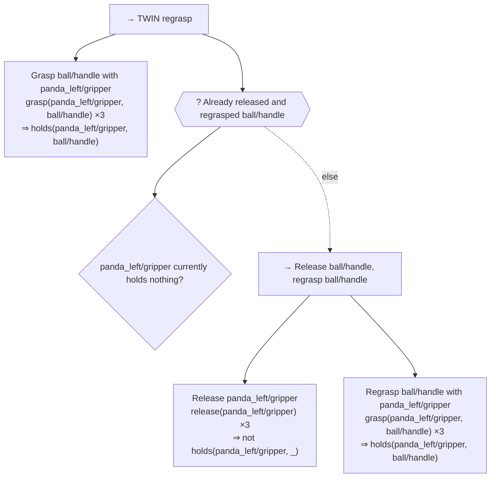

# Using `long_tamp` with BehaviorTree.CPP (ROS-free)

A second way to drive `long_tamp`, alongside the plain-Python API
([`standalone-usage.md`](standalone-usage.md)): a standalone C++ executable that compiles a
versioned task-plan IR into a BehaviorTree.CPP tree and drives HPP through an in-process
CPython bridge. No ROS, no network boundary. It targets a mission executive as its eventual
consumer, but keeps the whole call chain in one process and one language boundary
(C++ ↔ embedded CPython) rather than crossing a process/network boundary like a ROS 2
integration would. (A ROS 2 / Dynamic-Behavior-Tree integration previously existed here —
see [`../legacy/usage/dbt-integration.md`](../legacy/usage/dbt-integration.md) — but is tied
to a proprietary mission executive and isn't part of this release.)

This is also the intended landing spot for a **future** VLM/LLM planner: the IR, capability
registry, validator, and compiler are the extension points a model would target. That
integration does not exist yet — model output would be untrusted proposal data, never
executed as generated code.

For current status, what's been verified against a real mission, and what's still
open, see [§11](#11-known-gaps-and-roadmap) — this page otherwise only covers how to
build, run, and extend the pipeline itself. (Earlier revisions of this page linked to
`../report/behaviortree-screwdriving-report.md` and
`../plans/behaviortree-screwdriving-taskplan.md`; those were SpaceLab-mission-specific
docs that never made it into this repo's split from `agimus_spacelab` — the links were
dead from the split onward.)

## 1. The big picture

```
Hand-authored (or future model-proposed) TaskPlan IR
    │  CapabilityRegistry-checked validation (model.py)
    ▼
Deterministic IR-to-BT compiler (compiler.py) ──► BehaviorTree.CPP XML + source map
    │
    ▼
Any BehaviorTree.CPP 4 tree: the example host (examples/behaviortree/), your own, ROS 2 / Nav2
    │  task-planning nodes (long_tamp_bt_nodes, or the plugin) + a TaskSession on the blackboard
    ▼
A TaskSession: embedded CPython (PythonTaskSession, in-process, no RPC), or your own
    ▼
Python TaskPlanningSession / HostSession (session.py, host.py)
    │
    ▼
Your mission-specific adapter (own module, own factory in host.py) ──► long_tamp / PyHPP
```

The generic layer ships one adapter, `create_fake_session` (used for CTest
conformance/fault-path coverage, no PyHPP) — a template for the shape a real adapter takes.
A real mission adapter (its own capability registry, `TaskPlan` document, session
subclass) is meant to live in your own module and register its own factory in `host.py`
(see §9); the generic layer itself knows nothing about any specific robot, mission, or
gripper. This repo previously shipped a SpaceLab screwdriving adapter under
`script/spacelab/` as the reference example; it has been removed as SpaceLab-mission-
specific content (not part of the open-source release), and its design record never made
it into this repo either (see the note above).

A real, from-scratch (no SpaceLab content) mission adapter now lives under
`script/twin/twin_bt_session.py`, driving TWIN's bimanual lift-ball scene
(`script/twin/task_lift_ball.py`) through this exact pipeline — its `grasp`/`release`
capabilities wrap `GraspSequencePlanner.grasp()`/`.release()` (see `grasp_sequence.py`'s
module docstring), not mission-specific planning code. Factory: `create_twin_session`.
It's a small reference example (two grasps, no release), not the proven long-horizon
multi-phase mission this project still wants eventually — see §7 and §6 for building and
running it.

## 2. Component map

| File | Role |
|---|---|
| `src/long_tamp/tasks/task_planning/model.py` | `TaskPlan` — schema/semantic validation, canonical JSON, SHA-256 `plan_fingerprint` binding the plan *and* the capability registry snapshot |
| `src/long_tamp/tasks/task_planning/capabilities.py` | `CapabilityDescriptor` (policy: required params, `max_attempts`, `max_timeout`, `restartable`) and `CapabilityRegistry` (binds descriptors to trusted callables; `freeze()`s before execution) |
| `src/long_tamp/tasks/task_planning/compiler.py` | `compile_behavior_tree()` — deterministic, allowlisted-element IR→XML compiler; output carries its own `artifact_fingerprint` |
| `src/long_tamp/tasks/task_planning/session.py` | `TaskPlanningSession` — dispatches transactions/conditions through the frozen registry; freezes the registry on construction |
| `src/long_tamp/tasks/task_planning/host.py` | Allowlisted session factories the C++ host is permitted to call: `create_fake_session`, plus one per mission you add (§9) |
| `examples/behaviortree/` | The C++ side (§5): `include/long_tamp_bt/task_session.hpp` (the session interface), `task_nodes` (the nodes, `long_tamp_bt_nodes`), `plugin.cpp` (`long_tamp_bt_nodes_plugin`), `python_task_session` (the CPython bridge), `event_logger`, `main.cpp` (the example host: CLI + allowlist), `test/plugin_loads.cpp` (a stock factory loads the plugin) |
| `src/long_tamp/planning/path_recorder.py`, `path_io.py` | `PathRecorder` capture and `replay`/validation helpers a mission-specific session can reuse for checkpointing |
| `src/long_tamp/tasks/grasp_sequence.py` — `GraspSequencePlanner.grasp()`/`.release()` | Standalone, precondition-checked, `dict -> dict` capability primitives (never raise) — the natural implementation for a mission's `grasp`/`release` capabilities; see the module docstring for why they exist and how they differ from `plan_sequence()`'s internal per-phase calls |
| `src/long_tamp/tasks/sequence_orchestrator.py` — `run_sequence()` | Reference orchestrator built purely on `grasp()`/`release()`, reproducing `plan_sequence()`'s auto-release sequencing policy as external, swappable code — a worked example of what a BT tree or a symbolic planner needs to reproduce, not something the BT path itself calls |

## 3. Task Plan IR contract

A plan is a JSON document: `schema_version` (must be `"1.0"`), `mission_id`, `scene`,
`provenance`, and a `root` node tree of `sequence` / `fallback` / `retry` / `condition` /
`operation` / `transaction` nodes. Every node id must match `^[A-Za-z][A-Za-z0-9_.-]{0,127}$`
and be unique across the whole tree.

- **`transaction`** — exactly one `operation` child; requires `restart_state` (a list of
  session-state keys it restarts from); the child's capability **must** be registered
  `restartable=True` or validation rejects the plan.
- **`retry`** — one child, `max_attempts` capped at the child's effective attempt budget
  (can't loosen a capability's own limit by wrapping it in `retry`).
- **`operation` / `condition`** — reference a `capability` id that must already be in the
  registry; `parameters` are type-checked against `descriptor.required_parameters`;
  `constraints.max_attempts` / `max_timeout` are capped at the descriptor's own limits, never
  raised.

### Preconditions and effects

Capabilities declare what a step needs and what it achieves, as literals over its
parameters (`long_tamp.tasks.task_planning.predicates`, see ADR-0002):

```python
CapabilityDescriptor(
    "grasp", "1.0", {"gripper": str, "handle": str},
    preconditions=("not holds(?gripper, _)", "not holds(_, ?handle)"),
    effects=("holds(?gripper, ?handle)",),
    writes=("grasp_state",),        # state tags the step touches (was `effects` before 0.2)
    restartable=True,
)
```

`?name` binds to the step parameter `name`, `_` matches anything, and `not` negates. A
negative effect deletes every matching atom (`not holds(?gripper, _)` empties the
gripper). For a capability used as a `condition`, the preconditions are what it tests.

A plan may declare an optional **`initial_state`**: a list of ground atoms
(`["holds(left, ball)"]`, closed world). When present, `TaskPlan.from_dict` simulates every
branch of the plan from it (a failed step leaves the state unchanged; a `fallback` explores
each child from the states where the previous ones failed) and rejects the plan if an
operation can be reached with a precondition false, naming the step, the literal and the
state. Without `initial_state`, only the syntax and parameter binding are checked.

At run time, a session built with `world_state=` (a callable returning the current ground
atoms) makes `TaskStepReady` evaluate the step's grounded preconditions against the world;
the response lists any `unsatisfied` literals. Without it, `TaskStepReady` only checks that
the step exists.

The same session answers **"is this step done?"** from the world too (`TaskStepComplete`,
`execute_step`): a transaction whose operation declares effects is complete exactly when
all its grounded effects hold. A step whose effect already holds is skipped without
running (`status: "skipped"`, `message: "effect already holds"`), so a mission started
from a partly done state, or restarted, picks up where the world is. A step whose effect
was undone after it ran (a part slipped out) runs again. Steps without declared effects,
and sessions without `world_state=`, fall back to the in-memory record of steps completed
in this run. `is_step_complete` reports the `reason` (`effect_holds`,
`effect_not_holding`, `completed_this_run`, `not_completed`).

The world state comes from two kinds of sources (`task_planning/world_state.py`), and
nothing else may feed it:

- **observed** predicates, read live from the world model: `GraspTrackerState(planner)`
  reports `holds(gripper, handle)` from the planner's grasp tracker (pass the planner, not
  the tracker: the planner replaces its tracker object on resume/reset);
- **recorded** facts, which no sensor shows once a step is over (a screw driven in):
  `RecordedFacts(path, predicates={"screwed"})` holds them, persisted atomically to `path`.
  A session built with `recorded=` writes a step's grounded effects on those predicates
  **only when the step completes**; failed steps and plan validation never write.

```python
recorded = RecordedFacts(run_dir / "facts.json", predicates={"screwed", "racked"})
world = CompositeWorldState(GraspTrackerState(planner), recorded)
session = TaskPlanningSession(plan, registry, world_state=world, recorded=recorded)
```

Planner bookkeeping (a plan computed, an attempt count) is never a predicate.

`TaskPlan.from_dict(document, registry)` normalizes (NFC, sorted keys, finite numbers only),
validates, and returns a frozen `TaskPlan` whose `.document` property is a **defensive deep
copy** — callers can't mutate the validated IR in place. `plan_fingerprint` hashes the
normalized plan together with the registry's own snapshot, so the same plan JSON compiled
against a different capability registry produces a different fingerprint.

## 4. Compiler → BT XML mapping

`compile_behavior_tree()` wraps the whole tree in `SetupTaskPlan` / `FinalizeTaskPlan` and
maps IR nodes deterministically:

| IR node | Compiled BT shape |
|---|---|
| `transaction` | `Fallback[ TaskStepComplete, Sequence[ TaskStepReady, RetryUntilSuccessful(num_attempts=effective)[ ExecuteTaskStep ] ] ]` — already-complete (effect holds in the world, see §3) short-circuits, not-ready fails without consuming a retry |
| `retry` | `RetryUntilSuccessful(num_attempts=effective)` wrapping the compiled child |
| `operation` | `ExecuteTaskStep` |
| `condition` | `TaskCapabilityCondition` |
| `sequence` / `fallback` | `Sequence` / `Fallback` |

Every compiled node keeps a `source_map` entry back to its IR path, and every BT element
emitted for an IR node carries `_ir_id` (the IR node's id) and `_ir_role` (its part in that
node: `transaction`, `complete`, `ready`, `precondition`, `attempts`, `execute` for a
transaction's elements, else the node type). BehaviorTree.CPP keeps both as non-port
attributes (`node.config().other_attributes`); the event stream uses them (§7). The resulting
`CompiledBehaviorTree.artifact_fingerprint` is a SHA-256 over `{plan_fingerprint,
compiler_version, xml, source_map}` — the C++ side and any stored checkpoint can both assert
they're looking at the exact plan+compiler combination that produced a given run.

### Plan diagrams

`long_tamp.tasks.task_planning.visualize` renders a validated plan as Mermaid
(`to_mermaid(plan)`) or Graphviz (`to_dot(plan)`), to review a plan (a generated one
especially) before running it. Sequences are `→`, fallbacks `?` hexagons whose alternatives
are dashed `else` edges, conditions diamonds, and transactions show their capability call
and attempt budget; pass `registry=` to also show each step's grounded effects (`⇒`). The
TWIN regrasp plan (`script/twin/twin_bt_session.py`):



## 5. C++ host, the node library and the plugin

The BT nodes the compiler emits are a library with a small session interface (#25). They
can be loaded into any BehaviorTree.CPP 4 factory, including ROS 2 and Nav2 trees, and
backed by a session that is Python, ROS 2 services, or plain C++.

| Target | What it is |
|---|---|
| `long_tamp_bt_nodes` | The six nodes (`SetupTaskPlan`, `TaskStepComplete`, `TaskStepReady`, `TaskCapabilityCondition`, `ExecuteTaskStep`, `FinalizeTaskPlan`) and the JSONL event logger. Link it and call `long_tamp_bt::RegisterNodes(factory)`. |
| `long_tamp_bt_nodes_plugin` | The same nodes as a BehaviorTree.CPP plugin (`BT_REGISTER_NODES`): `factory.registerFromPlugin("liblong_tamp_bt_nodes_plugin.so")`, or list it in Nav2's `plugin_lib_names`. |
| `long_tamp_bt_python` | `PythonTaskSession`: the session in embedded CPython, built by an allowlisted `long_tamp.tasks.task_planning.host` factory. |
| `agimus_taskplan_bt` | The example host: a Python session, the nodes, a tree from the session's compiled XML, and an optional event log. |

**The session interface** (`long_tamp_bt/task_session.hpp`, header-only): it has one method
per call the nodes make. Each takes and returns JSON text, the same protocol as the Python
`TaskPlanningSession`:

| Method | Called by | Returns |
|---|---|---|
| `setup(options_json)` | `SetupTaskPlan` | `{"status": "success" \| "failure"}` |
| `isStepComplete(step_id)` | `TaskStepComplete` | `{"complete": bool}` |
| `checkPrecondition(step_id)` | `TaskStepReady` | `{"ready": bool}` |
| `evaluateCondition(step_id)` | `TaskCapabilityCondition` | `{"value": bool}` |
| `executeStep(step_id)` | `ExecuteTaskStep` | `{"status": "success" \| "skipped" \| "retry" \| "failure", "message": ...}` |
| `finalize()` | `FinalizeTaskPlan` | `{"status": ...}` |
| `behaviorTreeXml()`, `report()` | the host | the compiled XML; a free-form summary |

**Where the nodes find it:** on the root blackboard, under `long_tamp_bt::kSessionKey`
(`"long_tamp_session"`), the way Nav2's nodes find `"node"`. Subtrees see it too:

```cpp
#include <long_tamp_bt/task_session.hpp>
#include <behaviortree_cpp/bt_factory.h>

BT::BehaviorTreeFactory factory;                       // a stock factory
factory.registerFromPlugin("liblong_tamp_bt_nodes_plugin.so");
auto blackboard = BT::Blackboard::create();
blackboard->set(long_tamp_bt::kSessionKey,
                std::shared_ptr<long_tamp_bt::TaskSession>(std::make_shared<MySession>()));
auto tree = factory.createTreeFromText(compiled_xml, blackboard);
tree.tickWhileRunning();
```

**In Nav2:** `bt_navigator` creates the blackboard, so a navigator plugin (or any node that
owns the blackboard) sets the entry before the tree runs. A ROS 2 session can forward each
call to a service, so the planner can run in another process.

**Example: the screw assembly through the plugin.** `screw_assembly_plugin`
(`src/screw_assembly_plugin.cpp`) is written as your own application would be. A stock
factory loads the nodes from the plugin, a session plans the screw-assembly cell on the real
HPP scene, the session goes on the blackboard, and the compiled plan's tree is ticked to the
end. The event stream starts with a `plan` event, so the viewer draws the real tree:

```bash
cmake --build build-bt --target screw_assembly_plugin
PYTHONPATH=$PWD/src ./build-bt/examples/behaviortree/screw_assembly_plugin \
    --plan full --events /tmp/screw/events.jsonl      # --plan short: a 4-step plan
python -m long_tamp.viewer serve /tmp/screw/events.jsonl   # watch it live; or replay
```

`--plan full` is the whole mission: every part clamped and screwed, the driver racked,
the parts released. It plans only, with nothing executed. A host gets the plan's IR document
from the Python session with `get_plan_document()`.

`taskplan_bt_plugin_loads` (CTest) is the acceptance test. It loads the plugin into a stock
factory, links only BehaviorTree.CPP, and runs a tree against a session written in C++: a
skipped step, a retried step, a subtree, a capability condition, and a clear error when no
session is set.

The example host `examples/behaviortree/src/main.cpp` takes `--factory <name>`, checked
against a hard-coded allowlist (`create_fake_session`, `create_twin_session`,
`create_twin_regrasp_session` and `create_screw_session` today; add your own mission factory
per §9). An unlisted name exits with the non-retryable code `2` and is never dispatched to
Python. It also takes `--options <json>`. It builds a `PythonTaskSession`, registers the
nodes (`RegisterNodes`), puts the session on the blackboard, builds the tree from
`session->behaviorTreeXml()` and ticks it to completion with a `BT::TreeObserver` attached.

**Threading**: every `PythonTaskSession` call must run on the BT/interpreter thread. An
earlier version dispatched PyHPP calls from a `std::async` worker and crashed on the
cross-thread GIL/HPP-state violation; there is no thread pool in the current design.

**Exit codes** (also the contract a process supervisor should interpret, per §9):

| Code | Meaning | Retried by the supervisor? |
|---|---|---|
| `0` | All transactions committed | — |
| `1` | Deterministic BT `FAILURE` (a capability raised for real, not a crash) | No — checkpoint left as-is for inspection |
| `2` | Non-retryable configuration/contract error (unknown `--factory`, malformed bridge contract) | No |
| `124` | Total wall-clock timeout | Preserved; re-invoke to continue |
| `125` | Max restart count exceeded | Preserved |
| signal / attempt timeout | Native crash or a single attempt exceeding `--attempt-timeout` | Yes, exponential backoff, from the preserved checkpoint |

## 6. Building

```bash
git submodule update --init cmake   # jrl-cmakemodules -- see below
cmake -S . -B build-bt \
  -DBUILD_BEHAVIORTREE_EXAMPLES=ON \
  -DBUILD_TESTING=ON
cmake --build build-bt --parallel --target agimus_taskplan_bt long_tamp_bt_nodes_plugin
```

The top-level `CMakeLists.txt` requires `jrl-cmakemodules` to configure *any* C++ build of
this repo, including just this standalone example — `cmake/` vendors it as a git submodule
(pinned to v2.1.0, the same version the sibling `agimus_spacelab` repo vendors). A checkout
that skips `git submodule update --init` fails at the very first `cmake -S` with
`Could not find a package configuration file provided by "jrl-cmakemodules"`.

`BUILD_BEHAVIORTREE_EXAMPLES` (default `OFF`) gates `add_subdirectory(examples/behaviortree)`
in the top-level `CMakeLists.txt`, so it never affects a normal library build.
`examples/behaviortree/CMakeLists.txt` fetches BehaviorTree.CPP via `FetchContent` pinned to a
known commit unless `BEHAVIORTREE_CPP_SOURCE_DIR` is already defined (vendored/cached
checkout), and always builds it with its own examples/tools/Groot/SQLite logging disabled.

Inside the dev container (`dockers/hpp-arm64/`), source both `config.sh` (`PATH`,
`PYTHONPATH`, `LD_LIBRARY_PATH`) and the `hpp` conda env before configuring — the container's
default shell has neither `cmake` nor a C++ compiler on `PATH` until both are sourced:

```bash
source ~/devel/hpp/dockers/hpp-arm64/config.sh
```

## 7. Running

Bounded conformance tests (no real PyHPP; safe anywhere, including CI):

```bash
ctest --test-dir build-bt --output-on-failure -R 'taskplan_bt_(fake|fault|events)'
```

`taskplan_bt_events` runs the fake session on the host and on the Python runner, one
transaction and a plan with every composite, each successful and failing, and checks that
both write the same event stream.

Real-mission CTest cases (TWIN's bimanual lift-ball) — need the real PyHPP backend and a
couple of minutes each, so they're opt-in via a separate CMake option, not part of the
default `-DBUILD_TESTING=ON` configure:

```bash
cmake -S . -B build-bt -DBUILD_BEHAVIORTREE_EXAMPLES=ON -DBUILD_TESTING=ON \
  -DBUILD_BEHAVIORTREE_REAL_MISSION_TESTS=ON
cmake --build build-bt --parallel --target agimus_taskplan_bt long_tamp_bt_nodes_plugin
ctest --test-dir build-bt --output-on-failure -R 'taskplan_bt_twin_lift_ball'  # flat two-grasp, create_twin_session
ctest --test-dir build-bt --output-on-failure -R 'taskplan_bt_twin_regrasp'    # forced release+regrasp, create_twin_regrasp_session (§11 item 1)
```

Run the host directly against your own mission factory (bypasses any supervisor you write —
useful for a single attempt or debugging a specific `--options` payload):

```bash
./build-bt/examples/behaviortree/agimus_taskplan_bt --factory create_twin_session \
  --events run/events.jsonl
```

`--events <path>` appends the mission's event stream: one JSON line per status change of a
plan node, in the same schema the Python executor writes ([Mission events](events.md)).

For a real, long-running PyHPP mission you'll typically also want a process supervisor
(attempt/total timeouts, checkpoint-resume, bounded restart backoff on crash/timeout) and a
`PathRecorder`-capture validator, built on the checkpoint/capture primitives in §8 — this
repo's own SpaceLab-specific versions of both (`run_taskplan_bt_supervised.py`,
`replay_captured_paths.py`) are not part of the open-source release.

## 8. Checkpointing and path capture

`checkpoint_dir` enables atomic checkpoint replacement to
`<checkpoint_dir>/taskplan_checkpoint.json`, validated against the compiled artifact's
fingerprint on load — a checkpoint written by a different plan/compiler combination is
rejected rather than silently resumed against. `capture_dir` enables `PathRecorder`, which
writes a `manifest.json` plus one `seg_*.json` per captured path segment; this is what
`replay_captured_paths.py --check` re-validates (continuity, quaternion-aware seam checks)
without touching HPP at all.

## 9. Adding a capability or a new mission

1. Write a `CapabilityDescriptor` (id, version, `required_parameters`, `preconditions`,
   `effects`, `writes`, `max_attempts`, `max_timeout`, and `restartable=True` if it will back
   a `transaction`; see §3 "Preconditions and effects") and a plain callable `dict -> dict`
   implementation.
2. `registry.register(descriptor, implementation)` into a fresh `CapabilityRegistry` — do
   this before constructing any `TaskPlanningSession`/`HostSession`; the registry freezes
   (`RuntimeError` on further `register`/`bind`) the moment a session is constructed.
3. Author the mission as a `TaskPlan` document (see §3 for the schema) and validate it
   with `TaskPlan.from_dict(document, registry)`.
4. Expose it through a new factory function in `host.py`, then add that factory's name to the
   `allowed_factories` set in `examples/behaviortree/src/main.cpp` — a factory not on both
   allowlists (Python import path *and* C++ set) can never be reached from the host.

## 10. Design properties

- **Process boundary**: none — one process, embedded CPython, no RPC.
- **Mission format**: versioned, validated JSON IR compiled deterministically to BT XML —
  not a hand-authored tree wired directly to C++ callbacks.
- **Capability contract**: explicit `CapabilityDescriptor` registry, frozen before
  execution — not implicit in whatever a service/action schema happens to expose.
- **Checkpointing**: built-in atomic checkpoint + fingerprint validation (§8).
- **Physical execution**: none — this host plans/advances simulated HPP configuration
  only; driving physical robots or a simulator is a downstream execution bridge's job,
  a separate package outside this library's planning-only scope.
- **Model/LLM extension point**: yes (deferred) — the IR/registry/validator are the
  intended target for a future model-proposed mission.

## 11. Known gaps and roadmap

Status as of the session that fixed this pipeline's two blocking infra bugs (the C++ host's
stale `agimus_spacelab.tasks.task_planning.host` import and the missing `jrl-cmakemodules`
submodule — neither of which is `long_tamp`-specific new work, just leftovers from the
`agimus_spacelab` split that had never been exercised since) and added the first real,
from-scratch mission (`create_twin_session`, §1). Verified for real: `agimus_taskplan_bt
--factory create_twin_session` reaches `Task plan status: SUCCESS` against TWIN's actual
bimanual scene, both grasps completed. Nothing below is broken — this is the gap between
"works" and "production-grade / proven on a harder scene."

**Real coverage gaps — the new machinery is proven on the easiest scene in the repo only:**

- ~~**Auto-release is untested at the BT level.**~~ **Done (§11 item 1).** A second
  factory, `create_twin_regrasp_session` (`twin_bt_session.py`'s
  `build_twin_regrasp_session`), compiles a `fallback`/`condition`-guarded
  release-then-regrasp document (`panda_left/gripper` releases and reacquires
  `ball/handle`) and is verified for real: `agimus_taskplan_bt --factory
  create_twin_regrasp_session` (opt-in CTest `taskplan_bt_twin_regrasp`) and
  `tests/test_twin_regrasp_bt_session.py` both reach a real, executed
  `release()` followed by a real, executed second `grasp()` of the same
  target — proving the compiler's per-transaction `Fallback` composes
  correctly with a top-level `fallback`/`condition`, not just the flat-
  sequence case. `create_twin_session`'s own flat two-grasp document is
  untouched (still exercises no release) — see the new side findings below
  for why this needed its own scene rather than extending that one.
- **No lookahead in the capability-driven path.** `find_feasible_phase_target()` (the fix
  for "phase N's random commitment silently dooms phase N+1," the part6/CON0 case documented
  in that method's own docstring) only exists inside `plan_sequence()`'s internals. A BT or
  symbolic-planner orchestrator built on `grasp()`/`release()` today has no equivalent
  protection — harmless for TWIN's independent bimanual grasps, but would resurface on any
  scene with that kind of grasp-to-grasp coupling.
- **`ikea_table_prototype` was never touched.** Every piece added this session (`grasp()`/
  `release()`, `run_sequence()`, the BT adapter) was built and proven against TWIN only —
  the simplest real scene in the repo (two independent grasps, no conflicts, no manual
  frozen-arms overrides). `ikea_table_prototype`'s harder shape (up to 12 phases,
  `frozen_arms_mode="manual"` overrides, auto-release actually firing) remains unvalidated
  through any of this new machinery.
- **Only `grasp`/`release` were promoted to capabilities.** `GraspSequencePlanner`'s other
  standalone primitives — `plan_pregrasp()`, `plan_transition()`, `plan_loop()` — have no
  capability/BT wrapper.

**Deferred by explicit choice — not started:**

- **PDDLStream-style symbolic search.** `task_planning/` only *executes* a hand-authored (or
  future model-proposed) plan; nothing in this repo *searches* for one. Real TAMP
  integration needs a predicate/effects layer a symbolic planner reads and writes, plus
  "stream" functions bridging PDDLStream-style continuous sampling requests to
  `ConfigGenerator`/`grasp()`. The predicate layer exists since 0.2 (§3: preconditions,
  effects, plan-time simulation); the symbolic search on top of it is roadmap M3.

**Not done by design — the risk/reward didn't justify it yet:**

- **`plan_sequence()`/`resume_sequence()`/`_run_phase_loop` are completely untouched.**
  `run_sequence()` is a parallel, additive alternative, not a replacement — nothing was
  deduplicated. If the eventual goal is "`plan_sequence()` becomes a thin wrapper over the
  same primitives `run_sequence()` uses," that refactor never happened; the two currently
  duplicate the auto-release policy independently.
- **No checkpoint/resume/process-supervisor wiring for the real BT mission.** §8's
  `checkpoint_dir`/`PathRecorder` capture exists generically, but `twin_bt_session.py`
  doesn't use it — a killed/crashed run has no resume path. §7 already documents that a real
  long-running mission needs a process supervisor (attempt/total timeouts, bounded restart
  backoff); no such supervisor exists anywhere in `long_tamp` (the SpaceLab one wasn't part
  of the open-source release).

**Known, unfixed side findings from building the TWIN adapter:**

- TWIN's `panda_left/gripper > ball/handle | f_12` edge intermittently fails with the same
  collision (`panda_left/panda_leftfinger_2` vs `ball/base_link_0`) across otherwise-clean
  runs — consistent enough to look like a real, marginal clearance in
  `script/twin/assets/pokeball_bimanual.urdf` rather than pure solver noise. See
  `tests/test_grasp_release_use_case_twin.py`'s docstring. Never investigated.
  Confirmed worse than "intermittent" for a *regrasp* specifically: building item 1's
  release-then-regrasp scenario against `panda_left/gripper`/`ball/handle`, the exact
  same `f_12` collision hit 100% of regrasp draws (0% of first-grasp draws) across two
  independent verification runs before `create_twin_regrasp_session`'s `grasp`
  capability's `max_attempts` was raised from 3 to 8 to compensate — still not
  root-caused (possibly the ball settling into a slightly different resting pose after a
  real `release()` than its pristine initial one, tightening this already-marginal
  clearance further), still out of scope for a compiler/session-level fix.
- **First-phase graph construction is markedly harder to solve than a later one on the
  same `GraspSequencePlanner`.** Discovered while picking item 1's regrasp target: the
  *same* `panda_right/gripper > ball/handle2` grasp that plans in ~18s as the *second*
  phase of TWIN's flat two-grasp mission (edge name `0-0_01`) failed 6/6 target-generation
  draws across two processes when built as the *only* phase of a single-gripper session
  (edge name `f_01`, no collision, solver residuals scattered 0.01–8.9) — i.e. an edge's
  real difficulty depends on whether `GraspSequencePlanner` already has another phase's
  graph structure to extend, not just on which gripper/handle pair it names. Not
  root-caused; worth knowing before assuming any single grasp's difficulty transfers
  between a multi-phase mission and a standalone one.
- The `taskplan_bt_twin_lift_ball` CTest case is opt-in only
  (`BUILD_BEHAVIORTREE_REAL_MISSION_TESTS=OFF` by default) and not wired into any CI
  pipeline — nothing runs it automatically. It is also not perfectly reliable itself:
  observed one real `SIGSEGV` crash (not the `f_12` collision above — a fresh
  `create_twin_session` run died mid-generation on its very first waypoint draw) in
  four runs during this same session, alongside three clean `SUCCESS` runs. Not
  root-caused; flagged here since item 1's own opt-in CTest (`taskplan_bt_twin_regrasp`)
  shares the same binary and could in principle hit the same crash.

### Suggested order

1. ~~**Exercise auto-release through a BT tree against TWIN or a small synthetic
   scene**~~ **Done** — see `create_twin_regrasp_session` above and the new side
   findings (regrasp-specific `f_12` flakiness, first-phase-vs-later-phase graph
   difficulty) this surfaced.
2. **Wire `ikea_table_prototype` through `grasp()`/`release()`/`run_sequence()`** — the
   real stress test: manual frozen-arms overrides, an actual auto-release, and enough
   phases to surface whether the missing-lookahead gap above matters in practice before
   investing in fixing it.
3. **Only then** decide whether the lookahead gap needs a capability-layer equivalent, and
   whether `plan_sequence()` should be refactored to route through `run_sequence()` instead
   of duplicating its policy — both are premature to design against a single two-phase
   scene.
4. **PDDLStream integration** stays last: it's the biggest, most speculative piece, and
   items 2–3 will surface exactly which predicates/effects/streams a real domain needs —
   designing them now would be guessing.
